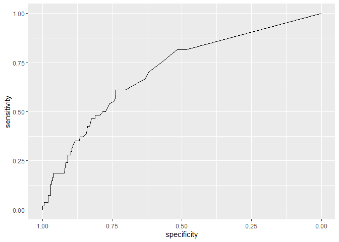

### LLPS data

Dimensions:

    ## [1] 3498   13

Train / Test

    ## 
    ##  Test Train 
    ##   350  3148

    ## # A tibble: 4 × 3
    ##   positive Fold      n
    ##   <lgl>    <chr> <int>
    ## 1 FALSE    Test    296
    ## 2 FALSE    Train  2655
    ## 3 TRUE     Test     54
    ## 4 TRUE     Train   493

### K-mer space:

k-mer properties:

    ##    length gaps
    ## 1       1     
    ## 2       2     
    ## 3       2    1
    ## 4       2    2
    ## 5       2    3
    ## 6       2    4
    ## 7       3   00
    ## 8       3   10
    ## 9       3   20
    ## 10      3   30
    ## 11      3   40
    ## 12      3   50
    ## 13      3   60
    ## 14      3   01
    ## 15      3   11
    ## 16      3   21
    ## 17      3   31
    ## 18      3   41
    ## 19      3   51
    ## 20      3   02
    ## 21      3   12
    ## 22      3   22
    ## 23      3   32
    ## 24      3   42
    ## 25      3   03
    ## 26      3   13
    ## 27      3   23
    ## 28      3   33
    ## 29      3   04
    ## 30      3   14
    ## 31      3   24
    ## 32      3   05
    ## 33      3   15
    ## 34      3   06

k-mer data:

    ## [1]   3498 226013

### mbic2 results:

    ##  [1] "Q.Q.P_0.5" "S.S.S_0.0" "R.G.G_0.0" "Q.Q.P_5.1" "S.N.N_4.2" "K.K.H_4.2"
    ##  [7] "Y.P.P_1.0" "G.S.S_1.2" "P.V.P_4.1" "R.G.R_5.1" "Q.Q.N_4.2" "K.Q.S_1.2"

    ## Warning in asMethod(object): sparse->dense coercion: allocating vector of size
    ## 5.3 GiB

### Logistic model:

    ## Setting levels: control = 0, case = 1

    ## Setting direction: controls < cases

    ## Setting levels: control = 0, case = 1
    ## Setting direction: controls < cases

    ## Area under the curve: 0.697

    confusionMatrix(as.factor(as.numeric(predicted > 0.5)), as.factor(test_y))

    ## Confusion Matrix and Statistics
    ## 
    ##           Reference
    ## Prediction   0   1
    ##          0 280  47
    ##          1  16   7
    ##                                           
    ##                Accuracy : 0.82            
    ##                  95% CI : (0.7757, 0.8588)
    ##     No Information Rate : 0.8457          
    ##     P-Value [Acc > NIR] : 0.9178738       
    ##                                           
    ##                   Kappa : 0.0987          
    ##                                           
    ##  Mcnemar's Test P-Value : 0.0001571       
    ##                                           
    ##             Sensitivity : 0.9459          
    ##             Specificity : 0.1296          
    ##          Pos Pred Value : 0.8563          
    ##          Neg Pred Value : 0.3043          
    ##              Prevalence : 0.8457          
    ##          Detection Rate : 0.8000          
    ##    Detection Prevalence : 0.9343          
    ##       Balanced Accuracy : 0.5378          
    ##                                           
    ##        'Positive' Class : 0               
    ## 

    cv_result <- cv.glm(data = cbind(train_y, train_filtered), 
                        glmfit = logistic_model, K = 10)
    cv_result$delta 

    ## [1] 0.1037308 0.1036542

### Logistic model with all two-way interactions:

    ## Setting levels: control = 0, case = 1

    ## Setting direction: controls < cases

    ## Setting levels: control = 0, case = 1
    ## Setting direction: controls < cases

    ## Area under the curve: 0.7056

    confusionMatrix(as.factor(as.numeric(predicted > 0.5)), as.factor(test_y))

    ## Confusion Matrix and Statistics
    ## 
    ##           Reference
    ## Prediction   0   1
    ##          0 283  44
    ##          1  13  10
    ##                                           
    ##                Accuracy : 0.8371          
    ##                  95% CI : (0.7942, 0.8743)
    ##     No Information Rate : 0.8457          
    ##     P-Value [Acc > NIR] : 0.702           
    ##                                           
    ##                   Kappa : 0.1846          
    ##                                           
    ##  Mcnemar's Test P-Value : 7.08e-05        
    ##                                           
    ##             Sensitivity : 0.9561          
    ##             Specificity : 0.1852          
    ##          Pos Pred Value : 0.8654          
    ##          Neg Pred Value : 0.4348          
    ##              Prevalence : 0.8457          
    ##          Detection Rate : 0.8086          
    ##    Detection Prevalence : 0.9343          
    ##       Balanced Accuracy : 0.5706          
    ##                                           
    ##        'Positive' Class : 0               
    ## 

    cv_result <- cv.glm(data = cbind(train_y, train_filtered), 
                        glmfit = logistic_model, K = 10)
    cv_result$delta 

    ## [1] 0.1095520 0.1089585

### Preliminary filtering via Pearson correlation tests

    candidates <- readRDS("../reduced_02.RDS")

    length(candidates)

    ## [1] 102156

### LASSO model

    # dat <- prepare_data(train_y, train_x, type = "logistic") 

    # dat_reduced <- dat %>% 
    #   reduce_matrix(minpv = 0.2) # to się długo liczy

    # saveRDS(dat_reduced$candidates, "llps_dat/reduced_02.RDS")

    candidates <- readRDS("../reduced_02.RDS")

    train_x_reduced <- train_x[, candidates]
    test_x_reduced <- data.frame((as.matrix(kmers[test_ids, candidates])))

    # res_lasso <- glmnet(train_x_reduced, train_y, family = "binomial") # to się liczy chwile
    # saveRDS(res_lasso, "lasso_results.RDS")

    res_lasso <- readRDS("../lasso_results.RDS")
    # cv_lasso_res <- cv.glmnet(train_x_reduced, train_y, family = "binomial") # za długie to jest

    inv_logit <- function(xb) exp(xb)/(1 + exp(xb))

    predicted <- predict.glmnet(res_lasso, newx = as.matrix(test_x_reduced), type = "response")
    predicted <- apply(predicted, 2, inv_logit)

    dt_coefs <- data.frame(as.matrix(coef.glmnet(res_lasso))) 

    lambda_df <- data.frame(path = names(res_lasso$a0), lambda = res_lasso$lambda)

    dt_coefs <- dt_coefs %>% 
      mutate(beta = rownames(dt_coefs)) %>% 
      tidyr::gather(path, estimator, -beta) %>% 
      left_join(lambda_df, by = "path")

    dt_coefs %>% 
      filter(beta %in% chosen_kmers) %>% 
      ggplot(aes(x = lambda, y = estimator, group_by(beta), col = beta)) +
      geom_line()

    aucs <- sapply(1:ncol(predicted), function(ith_lambda) {
      predicted_single_lambda <- predicted[, ith_lambda]
      auc(test_y, predicted_single_lambda)
    })

    ## Setting levels: control = 0, case = 1

    ## Setting direction: controls < cases

    ## Setting levels: control = 0, case = 1

    ## Setting direction: controls < cases

    ## Setting levels: control = 0, case = 1

    ## Setting direction: controls < cases

    ## Setting levels: control = 0, case = 1

    ## Setting direction: controls < cases

    ## Setting levels: control = 0, case = 1

    ## Setting direction: controls < cases

    ## Setting levels: control = 0, case = 1

    ## Setting direction: controls < cases

    ## Setting levels: control = 0, case = 1

    ## Setting direction: controls < cases

    ## Setting levels: control = 0, case = 1

    ## Setting direction: controls < cases

    ## Setting levels: control = 0, case = 1

    ## Setting direction: controls < cases

    ## Setting levels: control = 0, case = 1

    ## Setting direction: controls < cases

    ## Setting levels: control = 0, case = 1

    ## Setting direction: controls < cases

    ## Setting levels: control = 0, case = 1

    ## Setting direction: controls < cases

    ## Setting levels: control = 0, case = 1

    ## Setting direction: controls < cases

    ## Setting levels: control = 0, case = 1

    ## Setting direction: controls < cases

    ## Setting levels: control = 0, case = 1

    ## Setting direction: controls < cases

    ## Setting levels: control = 0, case = 1

    ## Setting direction: controls < cases

    ## Setting levels: control = 0, case = 1

    ## Setting direction: controls < cases

    ## Setting levels: control = 0, case = 1

    ## Setting direction: controls < cases

    ## Setting levels: control = 0, case = 1

    ## Setting direction: controls < cases

    ## Setting levels: control = 0, case = 1

    ## Setting direction: controls < cases

    ## Setting levels: control = 0, case = 1

    ## Setting direction: controls < cases

    ## Setting levels: control = 0, case = 1

    ## Setting direction: controls < cases

    ## Setting levels: control = 0, case = 1

    ## Setting direction: controls < cases

    ## Setting levels: control = 0, case = 1

    ## Setting direction: controls < cases

    ## Setting levels: control = 0, case = 1

    ## Setting direction: controls < cases

    ## Setting levels: control = 0, case = 1

    ## Setting direction: controls < cases

    ## Setting levels: control = 0, case = 1

    ## Setting direction: controls < cases

    ## Setting levels: control = 0, case = 1

    ## Setting direction: controls < cases

    ## Setting levels: control = 0, case = 1

    ## Setting direction: controls < cases

    ## Setting levels: control = 0, case = 1

    ## Setting direction: controls < cases

    ## Setting levels: control = 0, case = 1

    ## Setting direction: controls < cases

    ## Setting levels: control = 0, case = 1

    ## Setting direction: controls < cases

    ## Setting levels: control = 0, case = 1

    ## Setting direction: controls < cases

    ## Setting levels: control = 0, case = 1

    ## Setting direction: controls < cases

    ## Setting levels: control = 0, case = 1

    ## Setting direction: controls < cases

    ## Setting levels: control = 0, case = 1

    ## Setting direction: controls < cases

    ## Setting levels: control = 0, case = 1

    ## Setting direction: controls < cases

    ## Setting levels: control = 0, case = 1

    ## Setting direction: controls < cases

    ## Setting levels: control = 0, case = 1

    ## Setting direction: controls < cases

    ## Setting levels: control = 0, case = 1

    ## Setting direction: controls < cases

    ## Setting levels: control = 0, case = 1

    ## Setting direction: controls < cases

    ## Setting levels: control = 0, case = 1

    ## Setting direction: controls < cases

    ## Setting levels: control = 0, case = 1

    ## Setting direction: controls < cases

    ## Setting levels: control = 0, case = 1

    ## Setting direction: controls < cases

    ## Setting levels: control = 0, case = 1

    ## Setting direction: controls < cases

    ## Setting levels: control = 0, case = 1

    ## Setting direction: controls < cases

    ## Setting levels: control = 0, case = 1

    ## Setting direction: controls < cases

    ## Setting levels: control = 0, case = 1

    ## Setting direction: controls < cases

    ## Setting levels: control = 0, case = 1

    ## Setting direction: controls < cases

    ## Setting levels: control = 0, case = 1

    ## Setting direction: controls < cases

    ## Setting levels: control = 0, case = 1

    ## Setting direction: controls < cases

    ## Setting levels: control = 0, case = 1

    ## Setting direction: controls < cases

    ## Setting levels: control = 0, case = 1

    ## Setting direction: controls < cases

    ## Setting levels: control = 0, case = 1

    ## Setting direction: controls < cases

    ## Setting levels: control = 0, case = 1

    ## Setting direction: controls < cases

    ## Setting levels: control = 0, case = 1

    ## Setting direction: controls < cases

    ## Setting levels: control = 0, case = 1

    ## Setting direction: controls < cases

    ## Setting levels: control = 0, case = 1

    ## Setting direction: controls < cases

    ## Setting levels: control = 0, case = 1

    ## Setting direction: controls < cases

    ## Setting levels: control = 0, case = 1

    ## Setting direction: controls < cases

    ## Setting levels: control = 0, case = 1

    ## Setting direction: controls < cases

    ## Setting levels: control = 0, case = 1

    ## Setting direction: controls < cases

    ## Setting levels: control = 0, case = 1

    ## Setting direction: controls < cases

    ## Setting levels: control = 0, case = 1

    ## Setting direction: controls < cases

    ## Setting levels: control = 0, case = 1

    ## Setting direction: controls < cases

    ## Setting levels: control = 0, case = 1

    ## Setting direction: controls < cases

    ## Setting levels: control = 0, case = 1

    ## Setting direction: controls < cases

    ## Setting levels: control = 0, case = 1

    ## Setting direction: controls < cases

    ## Setting levels: control = 0, case = 1

    ## Setting direction: controls < cases

    ## Setting levels: control = 0, case = 1

    ## Setting direction: controls < cases

    ## Setting levels: control = 0, case = 1

    ## Setting direction: controls < cases

    ## Setting levels: control = 0, case = 1

    ## Setting direction: controls < cases

    ## Setting levels: control = 0, case = 1

    ## Setting direction: controls < cases

    ## Setting levels: control = 0, case = 1

    ## Setting direction: controls < cases

    ## Setting levels: control = 0, case = 1

    ## Setting direction: controls < cases

    ## Setting levels: control = 0, case = 1

    ## Setting direction: controls < cases

    ## Setting levels: control = 0, case = 1

    ## Setting direction: controls < cases

    ## Setting levels: control = 0, case = 1

    ## Setting direction: controls < cases

    ## Setting levels: control = 0, case = 1

    ## Setting direction: controls < cases

    ## Setting levels: control = 0, case = 1

    ## Setting direction: controls < cases

    ## Setting levels: control = 0, case = 1

    ## Setting direction: controls < cases

    ## Setting levels: control = 0, case = 1

    ## Setting direction: controls < cases

    ## Setting levels: control = 0, case = 1

    ## Setting direction: controls < cases

    ## Setting levels: control = 0, case = 1

    ## Setting direction: controls < cases

    ## Setting levels: control = 0, case = 1

    ## Setting direction: controls < cases

    ## Setting levels: control = 0, case = 1

    ## Setting direction: controls < cases

    ## Setting levels: control = 0, case = 1

    ## Setting direction: controls < cases

    ## Setting levels: control = 0, case = 1

    ## Setting direction: controls < cases

    ## Setting levels: control = 0, case = 1

    ## Setting direction: controls < cases

    ## Setting levels: control = 0, case = 1

    ## Setting direction: controls < cases

    ## Setting levels: control = 0, case = 1

    ## Setting direction: controls < cases

    ## Setting levels: control = 0, case = 1

    ## Setting direction: controls < cases

    ## Setting levels: control = 0, case = 1

    ## Setting direction: controls < cases

    ## Setting levels: control = 0, case = 1

    ## Setting direction: controls < cases

    ## Setting levels: control = 0, case = 1

    ## Setting direction: controls < cases

    ## Setting levels: control = 0, case = 1

    ## Setting direction: controls < cases

    ## Setting levels: control = 0, case = 1

    ## Setting direction: controls < cases

    ## Setting levels: control = 0, case = 1

    ## Setting direction: controls < cases

    ## Setting levels: control = 0, case = 1

    ## Setting direction: controls < cases

    ## Setting levels: control = 0, case = 1

    ## Setting direction: controls < cases

    data.frame(auc = aucs,
               lambda = res_lasso$lambda) %>% 
      ggplot(aes(x = lambda, y = auc)) +
      geom_line() +
      scale_x_reverse()

    predicted_single_lambda <- predicted[, 100]
    rocobj <- roc(test_y, predicted_single_lambda)

    ## Setting levels: control = 0, case = 1
    ## Setting direction: controls < cases

    ggroc(rocobj)

    auc(test_y, predicted_single_lambda)

    ## Setting levels: control = 0, case = 1
    ## Setting direction: controls < cases

    ## Area under the curve: 0.679

    sum(coef.glmnet(res_lasso)[, 100] != 0)

    ## [1] 1333

    confusionMatrix(as.factor(as.numeric(predicted_single_lambda > 0.5)), as.factor(test_y))

    ## Confusion Matrix and Statistics
    ## 
    ##           Reference
    ## Prediction   0   1
    ##          0 281  48
    ##          1  15   6
    ##                                           
    ##                Accuracy : 0.82            
    ##                  95% CI : (0.7757, 0.8588)
    ##     No Information Rate : 0.8457          
    ##     P-Value [Acc > NIR] : 0.9179          
    ##                                           
    ##                   Kappa : 0.0806          
    ##                                           
    ##  Mcnemar's Test P-Value : 5.539e-05       
    ##                                           
    ##             Sensitivity : 0.9493          
    ##             Specificity : 0.1111          
    ##          Pos Pred Value : 0.8541          
    ##          Neg Pred Value : 0.2857          
    ##              Prevalence : 0.8457          
    ##          Detection Rate : 0.8029          
    ##    Detection Prevalence : 0.9400          
    ##       Balanced Accuracy : 0.5302          
    ##                                           
    ##        'Positive' Class : 0               
    ## 

### SLOPE

    res_slope <- readRDS("../res_slope.RDS")

    predicted <- predict(res_slope, as.matrix(test_x_reduced), type = "response")

    rocobj <- roc(test_y, predicted)

    ## Setting levels: control = 0, case = 1

    ## Setting direction: controls < cases

    ggroc(rocobj)

    auc(test_y, predicted)

    ## Setting levels: control = 0, case = 1
    ## Setting direction: controls < cases

    ## Area under the curve: 0.6839
