### Podsumowanie po poprzednim raporcie

1.  Metody nieliniowe

-   lasy losowe, XGboost, sieci neuronowe, superlearner
-   na zniorze cech z mbic2 (bez interakcji)
-   na zbiorze z korelacjami z mbic (zrobić glm i ridge, LASSO, SLOPE
    jeśli p&gt;50)

1.  LASSO, sLOPE, ridge, elastic net

-   na zbiorze z interakcjami
-   na zbiorze z korelacjami z mbic + ewentualnie interakcje

1.  Dużo większa liczba zmiennych, np. 1000, 3000, 5000 (wybrane testami
    brzegowymi)

-   zapuścić wszystko tak jak było

### mbic2: kmery

    library(biogram)

    ## Loading required package: slam

    library(seqR)
    library(ranger)
    library(bigstep)
    library(boot)
    library(pROC)

    ## Type 'citation("pROC")' for a citation.

    ## 
    ## Attaching package: 'pROC'

    ## The following objects are masked from 'package:stats':
    ## 
    ##     cov, smooth, var

    library(ggplot2)
    library(caret)

    ## Loading required package: lattice

    ## 
    ## Attaching package: 'lattice'

    ## The following object is masked from 'package:boot':
    ## 
    ##     melanoma

    ## Registered S3 method overwritten by 'lava':
    ##   method            from      
    ##   print.equivalence partitions

    library(dplyr)

    ## 
    ## Attaching package: 'dplyr'

    ## The following objects are masked from 'package:stats':
    ## 
    ##     filter, lag

    ## The following objects are masked from 'package:base':
    ## 
    ##     intersect, setdiff, setequal, union

    library(glmnet)

    ## Loading required package: Matrix

    ## Loaded glmnet 4.1-8

    library(tidyr)

    ## 
    ## Attaching package: 'tidyr'

    ## The following objects are masked from 'package:Matrix':
    ## 
    ##     expand, pack, unpack

    library(SLOPE)
    library(ggcorrplot)
    library(knitr)

    inv_logit <- function(xb) exp(xb)/(1 + exp(xb))

    df <- read.table("../llps_ml_dataset.csv", sep = "\t", header = TRUE)
    train_ids <- df[["Fold"]] == "Train"
    test_ids <- df[["Fold"]] == "Test"

    ### kmer space

    all_three_gaps <- expand.grid(0L:6, 0L:6)
    gaps_shorter_than6 <- all_three_gaps[rowSums(all_three_gaps) <= 6, ]

    k_vector_raw <- c(1, 2, 2, 2, 2, 2, rep(3, nrow(gaps_shorter_than6)))
    kmer_gaps_raw <- c(list(NULL, 
                            NULL, c(1), c(2), c(3), c(4)),
                       lapply(1L:nrow(gaps_shorter_than6), function(i)
                         unlist(gaps_shorter_than6[i, ], use.names = FALSE)))

    kmers <- count_multimers(
      df[["Full.seq"]],
      k_vector = k_vector_raw,
      kmer_gaps = kmer_gaps_raw,
      with_kmer_counts = FALSE,
      batch_size = 4)

    ######

    y <- !(df[["Datasets"]] %in% c("PDB", "DisProt"))

    train_y <- as.numeric(y[train_ids])
    train_x <- data.frame((as.matrix(kmers[train_ids, ])))

    ## Warning in asMethod(object): sparse->dense coercion: allocating vector of size
    ## 5.3 GiB

    test_y <- as.numeric(y[test_ids])
    test_x <- data.frame((as.matrix(kmers[test_ids, ])))

# GLM z mbic2

    chosen_kmers <- readRDS("../mbic_vars.RDS")
    train_x_reduced <- as.matrix(train_x[, chosen_kmers])
    test_x_reduced <- as.matrix(test_x[, chosen_kmers])

    logistic_model <- glm(train_y~., data = data.frame(train_x_reduced), family = "binomial")
    predicted <- predict(logistic_model, data.frame(test_x_reduced), type = "response")
    rocobj <- roc(test_y, predicted)

    ## Setting levels: control = 0, case = 1

    ## Setting direction: controls < cases

    ggroc(rocobj)

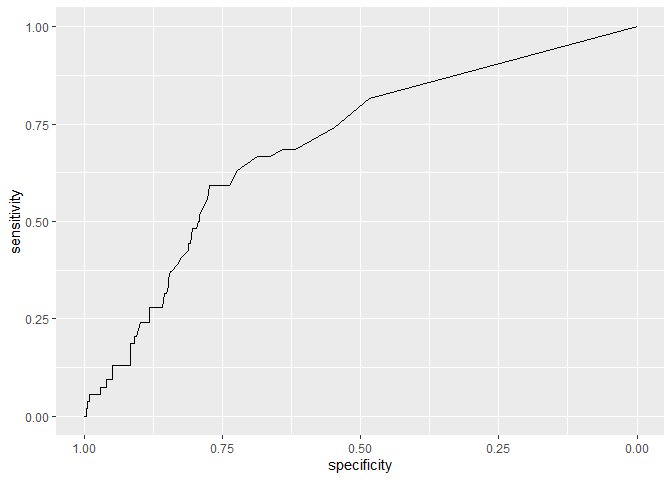

    auc(test_y, predicted)

    ## Setting levels: control = 0, case = 1
    ## Setting direction: controls < cases

    ## Area under the curve: 0.697

    confusionMatrix(as.factor(as.numeric(predicted > 0.5)), as.factor(test_y))

    ## Confusion Matrix and Statistics
    ## 
    ##           Reference
    ## Prediction   0   1
    ##          0 280  47
    ##          1  16   7
    ##                                           
    ##                Accuracy : 0.82            
    ##                  95% CI : (0.7757, 0.8588)
    ##     No Information Rate : 0.8457          
    ##     P-Value [Acc > NIR] : 0.9178738       
    ##                                           
    ##                   Kappa : 0.0987          
    ##                                           
    ##  Mcnemar's Test P-Value : 0.0001571       
    ##                                           
    ##             Sensitivity : 0.9459          
    ##             Specificity : 0.1296          
    ##          Pos Pred Value : 0.8563          
    ##          Neg Pred Value : 0.3043          
    ##              Prevalence : 0.8457          
    ##          Detection Rate : 0.8000          
    ##    Detection Prevalence : 0.9343          
    ##       Balanced Accuracy : 0.5378          
    ##                                           
    ##        'Positive' Class : 0               
    ## 

# Modele z interakcjami

    get_interactions_design <- function(y, x) {
      lm_model <- lm(y~ (.)^2, data = data.frame(x))
      model.matrix(lm_model)
    }

    source("../sparse_cor.R")

    train_x_reduced <- as.matrix(train_x[, chosen_kmers])
    test_x_reduced <- as.matrix(test_x[, chosen_kmers])

    design_matrix_train <- get_interactions_design(train_y, train_x_reduced)
    design_matrix_test <- get_interactions_design(test_y, test_x_reduced)

## Wymiar danych:

    dim(design_matrix_train)

    ## [1] 3148   79

    ggcorrplot(cor(design_matrix_train))

    ## Warning in cor(design_matrix_train): the standard deviation is zero

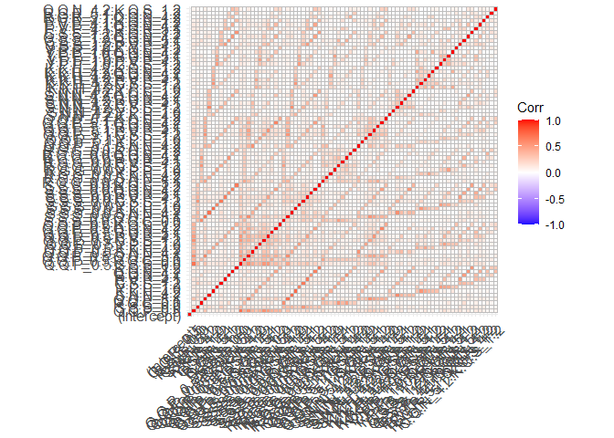

## GLM

    # glm

    logistic_model <- glm(train_y~., data = as.data.frame(design_matrix_train), family = "binomial")
    predicted <- predict(logistic_model, as.data.frame(design_matrix_test), type = "response")
    rocobj <- roc(test_y, predicted)

    ## Setting levels: control = 0, case = 1

    ## Setting direction: controls < cases

    ggroc(rocobj)

    auc(test_y, predicted)

    ## Setting levels: control = 0, case = 1
    ## Setting direction: controls < cases

    ## Area under the curve: 0.7056

## LASSO

    # LASSO

    lasso_cv <- cv.glmnet(design_matrix_train, train_y, family = "binomial")

    lambda_min <- lasso_cv$lambda.min

    lasso_res <- glmnet(design_matrix_train, train_y, family = "binomial",
                        lambda = lambda_min, thresh = 10^(-10), maxit = 10^(8))

    predicted <- predict.glmnet(lasso_res, newx = as.matrix(design_matrix_test), type = "response")
    predicted <- as.vector(inv_logit(predicted))

    rocobj <- roc(test_y, as.vector(predicted))

    ## Setting levels: control = 0, case = 1

    ## Setting direction: controls < cases

    ggroc(rocobj)

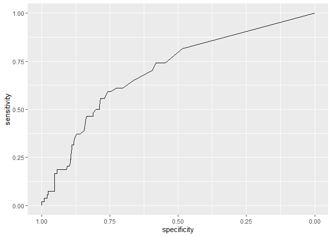

    auc(test_y, predicted)

    ## Setting levels: control = 0, case = 1
    ## Setting direction: controls < cases

    ## Area under the curve: 0.7029

    confusionMatrix(as.factor(as.numeric(predicted > 0.5)), as.factor(test_y))

    ## Confusion Matrix and Statistics
    ## 
    ##           Reference
    ## Prediction   0   1
    ##          0 283  48
    ##          1  13   6
    ##                                          
    ##                Accuracy : 0.8257         
    ##                  95% CI : (0.7818, 0.864)
    ##     No Information Rate : 0.8457         
    ##     P-Value [Acc > NIR] : 0.8658         
    ##                                          
    ##                   Kappa : 0.0914         
    ##                                          
    ##  Mcnemar's Test P-Value : 1.341e-05      
    ##                                          
    ##             Sensitivity : 0.9561         
    ##             Specificity : 0.1111         
    ##          Pos Pred Value : 0.8550         
    ##          Neg Pred Value : 0.3158         
    ##              Prevalence : 0.8457         
    ##          Detection Rate : 0.8086         
    ##    Detection Prevalence : 0.9457         
    ##       Balanced Accuracy : 0.5336         
    ##                                          
    ##        'Positive' Class : 0              
    ## 

### Elastic net

    # elastic net

    elastic_net <- glmnet(design_matrix_train, train_y, family = "binomial", 
                          alpha = 0.5, lambda = lambda_min, thresh = 10^(-10), 
                          maxit = 10^(8))

    predicted <- predict.glmnet(elastic_net, newx = as.matrix(design_matrix_test), type = "response")
    predicted <- as.vector(apply(predicted, 2, inv_logit))

    rocobj <- roc(test_y, predicted)

    ## Setting levels: control = 0, case = 1

    ## Setting direction: controls < cases

    ggroc(rocobj)

    auc(test_y, predicted)

    ## Setting levels: control = 0, case = 1
    ## Setting direction: controls < cases

    ## Area under the curve: 0.7012

    confusionMatrix(as.factor(as.numeric(predicted > 0.5)), as.factor(test_y))

    ## Confusion Matrix and Statistics
    ## 
    ##           Reference
    ## Prediction   0   1
    ##          0 281  45
    ##          1  15   9
    ##                                           
    ##                Accuracy : 0.8286          
    ##                  95% CI : (0.7849, 0.8666)
    ##     No Information Rate : 0.8457          
    ##     P-Value [Acc > NIR] : 0.8323459       
    ##                                           
    ##                   Kappa : 0.1501          
    ##                                           
    ##  Mcnemar's Test P-Value : 0.0001812       
    ##                                           
    ##             Sensitivity : 0.9493          
    ##             Specificity : 0.1667          
    ##          Pos Pred Value : 0.8620          
    ##          Neg Pred Value : 0.3750          
    ##              Prevalence : 0.8457          
    ##          Detection Rate : 0.8029          
    ##    Detection Prevalence : 0.9314          
    ##       Balanced Accuracy : 0.5580          
    ##                                           
    ##        'Positive' Class : 0               
    ## 

### Ridge

    # ridge

    ridge <- glmnet(design_matrix_train, train_y, family = "binomial", 
                    lambda = lambda_min, alpha = 0, thresh = 10^(-10), maxit = 10^(8))

    predicted <- predict.glmnet(ridge, newx = as.matrix(design_matrix_test), type = "response")
    predicted <- as.vector(apply(predicted, 2, inv_logit))

    rocobj <- roc(test_y, predicted)

    ## Setting levels: control = 0, case = 1

    ## Setting direction: controls < cases

    ggroc(rocobj)

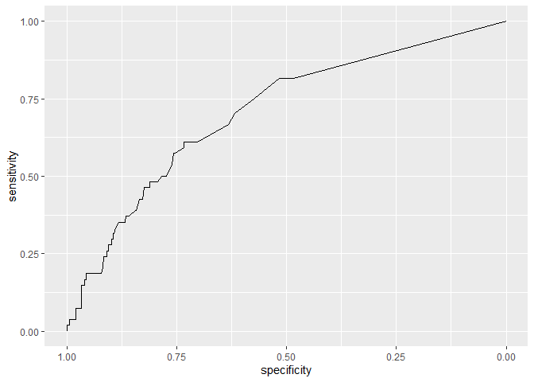

    auc(test_y, predicted)

    ## Setting levels: control = 0, case = 1
    ## Setting direction: controls < cases

    ## Area under the curve: 0.7055

    confusionMatrix(as.factor(as.numeric(predicted > 0.5)), as.factor(test_y))

    ## Confusion Matrix and Statistics
    ## 
    ##           Reference
    ## Prediction   0   1
    ##          0 283  44
    ##          1  13  10
    ##                                           
    ##                Accuracy : 0.8371          
    ##                  95% CI : (0.7942, 0.8743)
    ##     No Information Rate : 0.8457          
    ##     P-Value [Acc > NIR] : 0.702           
    ##                                           
    ##                   Kappa : 0.1846          
    ##                                           
    ##  Mcnemar's Test P-Value : 7.08e-05        
    ##                                           
    ##             Sensitivity : 0.9561          
    ##             Specificity : 0.1852          
    ##          Pos Pred Value : 0.8654          
    ##          Neg Pred Value : 0.4348          
    ##              Prevalence : 0.8457          
    ##          Detection Rate : 0.8086          
    ##    Detection Prevalence : 0.9343          
    ##       Balanced Accuracy : 0.5706          
    ##                                           
    ##        'Positive' Class : 0               
    ## 

### SLOPE

    ## slope

    res_slope <- SLOPE(design_matrix_train, train_y, family = "binomial", 
                       lambda = "bh", alpha = 0.01)

    predicted <- predict(res_slope, as.matrix(design_matrix_test), type = "response")

    rocobj <- roc(test_y, predicted)

    ## Setting levels: control = 0, case = 1

    ## Setting direction: controls < cases

    ggroc(rocobj)

    auc(test_y, predicted)

    ## Setting levels: control = 0, case = 1
    ## Setting direction: controls < cases

    ## Area under the curve: 0.7028

    confusionMatrix(as.factor(as.numeric(predicted > 0.5)), as.factor(test_y))

    ## Confusion Matrix and Statistics
    ## 
    ##           Reference
    ## Prediction   0   1
    ##          0 290  52
    ##          1   6   2
    ##                                           
    ##                Accuracy : 0.8343          
    ##                  95% CI : (0.7911, 0.8717)
    ##     No Information Rate : 0.8457          
    ##     P-Value [Acc > NIR] : 0.7503          
    ##                                           
    ##                   Kappa : 0.0257          
    ##                                           
    ##  Mcnemar's Test P-Value : 3.446e-09       
    ##                                           
    ##             Sensitivity : 0.97973         
    ##             Specificity : 0.03704         
    ##          Pos Pred Value : 0.84795         
    ##          Neg Pred Value : 0.25000         
    ##              Prevalence : 0.84571         
    ##          Detection Rate : 0.82857         
    ##    Detection Prevalence : 0.97714         
    ##       Balanced Accuracy : 0.50838         
    ##                                           
    ##        'Positive' Class : 0               
    ## 

## Skorelowane k-mery

Nie ma k-meró skorelowanych bardziej z tymi wybranymi przez mBIC2 niż
0.8!!

    ### z korelacjami

    # #### To się długo liczyło bardzio
    # correlated_kmers <- sparse_cor(mbic_chosen = chosen_kmers, 
    #                            train_x, 
    #                            dat[["candidates"]],
    #                            threshold = 0.8)
    # 
    # saveRDS(unique(correlated_kmers), "../correlated_kmers.RDS")

    chosen_kmers <- readRDS("../mbic_vars.RDS")

    # kmery skorelowane na poziomie 0.8
    correlated_kmers <- readRDS("../correlated_kmers.RDS")

    correlated_kmers

    ##  [1] "Q.Q.P_0.5" "S.S.S_0.0" "R.G.G_0.0" "Q.Q.P_5.1" "S.N.N_4.2" "K.K.H_4.2"
    ##  [7] "Y.P.P_1.0" "G.S.S_1.2" "P.V.P_4.1" "R.G.R_5.1" "Q.Q.N_4.2" "K.Q.S_1.2"

    # to jest to samo

## Więcej zmiennych (wybór rankingowy)

    ###################################

    # 3. Dużo większa liczba zmiennych, np. 1000, 3000, 5000 (wybrane testami brzegowymi)
    # - zapuścić wszystko tak jak było

    # dat <- prepare_data(train_y, train_x)
    # 
    # dat_reduced <- dat %>%
    #   reduce_matrix(minpv = 1)
    # 
    # saveRDS(dat_reduced$candidates, "../ranking.RDS")

    ranking <- readRDS("../ranking.RDS")

### 100 zmiennych

    # 100

    candidates <- ranking[1:100]

    train_x_reduced <- as.matrix(train_x[, candidates])
    test_x_reduced <- as.matrix(test_x[, candidates])

#### LASSO

    # lassso

    lasso_cv <- cv.glmnet(train_x_reduced, train_y, family = "binomial")

    lambda_min <- lasso_cv$lambda.min

    lasso_res <- glmnet(train_x_reduced, train_y, family = "binomial",
                        lambda = lambda_min, thresh = 10^(-10), maxit = 10^(8))

    predicted <- predict.glmnet(lasso_res, newx = as.matrix(test_x_reduced), type = "response")
    predicted <- as.vector(inv_logit(predicted))

    rocobj <- roc(test_y, as.vector(predicted))

    ## Setting levels: control = 0, case = 1

    ## Setting direction: controls < cases

    ggroc(rocobj)

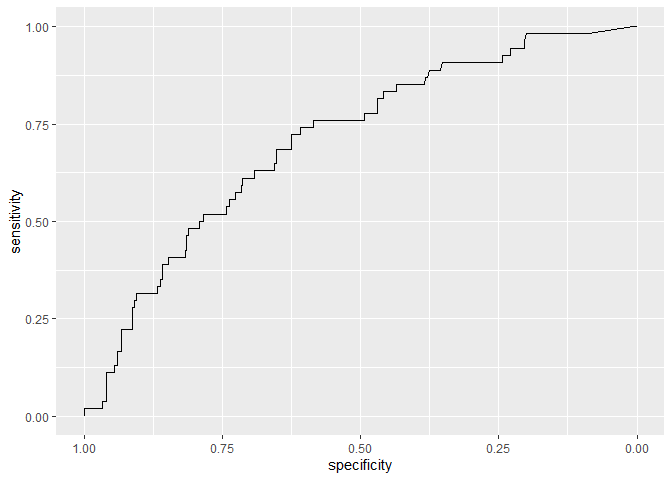

    auc(test_y, predicted)

    ## Setting levels: control = 0, case = 1
    ## Setting direction: controls < cases

    ## Area under the curve: 0.7073

    confusionMatrix(as.factor(as.numeric(predicted > 0.5)), as.factor(test_y))

    ## Confusion Matrix and Statistics
    ## 
    ##           Reference
    ## Prediction   0   1
    ##          0 285  52
    ##          1  11   2
    ##                                           
    ##                Accuracy : 0.82            
    ##                  95% CI : (0.7757, 0.8588)
    ##     No Information Rate : 0.8457          
    ##     P-Value [Acc > NIR] : 0.9179          
    ##                                           
    ##                   Kappa : -2e-04          
    ##                                           
    ##  Mcnemar's Test P-Value : 4.667e-07       
    ##                                           
    ##             Sensitivity : 0.96284         
    ##             Specificity : 0.03704         
    ##          Pos Pred Value : 0.84570         
    ##          Neg Pred Value : 0.15385         
    ##              Prevalence : 0.84571         
    ##          Detection Rate : 0.81429         
    ##    Detection Prevalence : 0.96286         
    ##       Balanced Accuracy : 0.49994         
    ##                                           
    ##        'Positive' Class : 0               
    ## 

    auc_lasso100 <- auc(test_y, predicted)

    ## Setting levels: control = 0, case = 1
    ## Setting direction: controls < cases

#### Elastic Net

    # elastic net

    elastic_net <- glmnet(train_x_reduced, train_y, family = "binomial", 
                          alpha = 0.5, lambda = lambda_min, thresh = 10^(-10), 
                          maxit = 10^(8))

    predicted <- predict.glmnet(elastic_net, newx = as.matrix(test_x_reduced), type = "response")
    predicted <- as.vector(apply(predicted, 2, inv_logit))

    rocobj <- roc(test_y, predicted)

    ## Setting levels: control = 0, case = 1

    ## Setting direction: controls < cases

    ggroc(rocobj)

    auc(test_y, predicted)

    ## Setting levels: control = 0, case = 1
    ## Setting direction: controls < cases

    ## Area under the curve: 0.7025

    confusionMatrix(as.factor(as.numeric(predicted > 0.5)), as.factor(test_y))

    ## Confusion Matrix and Statistics
    ## 
    ##           Reference
    ## Prediction   0   1
    ##          0 285  51
    ##          1  11   3
    ##                                           
    ##                Accuracy : 0.8229          
    ##                  95% CI : (0.7787, 0.8614)
    ##     No Information Rate : 0.8457          
    ##     P-Value [Acc > NIR] : 0.8942          
    ##                                           
    ##                   Kappa : 0.0264          
    ##                                           
    ##  Mcnemar's Test P-Value : 7.308e-07       
    ##                                           
    ##             Sensitivity : 0.96284         
    ##             Specificity : 0.05556         
    ##          Pos Pred Value : 0.84821         
    ##          Neg Pred Value : 0.21429         
    ##              Prevalence : 0.84571         
    ##          Detection Rate : 0.81429         
    ##    Detection Prevalence : 0.96000         
    ##       Balanced Accuracy : 0.50920         
    ##                                           
    ##        'Positive' Class : 0               
    ## 

    auc_en100 <- auc(test_y, predicted)

    ## Setting levels: control = 0, case = 1
    ## Setting direction: controls < cases

#### Elastic Net

    # ridge

    ridge <- glmnet(train_x_reduced, train_y, family = "binomial", 
                    lambda = lambda_min, alpha = 0, thresh = 10^(-10), maxit = 10^(8))

    predicted <- predict.glmnet(ridge, newx = as.matrix(test_x_reduced), type = "response")
    predicted <- as.vector(apply(predicted, 2, inv_logit))

    rocobj <- roc(test_y, predicted)

    ## Setting levels: control = 0, case = 1

    ## Setting direction: controls < cases

    ggroc(rocobj)

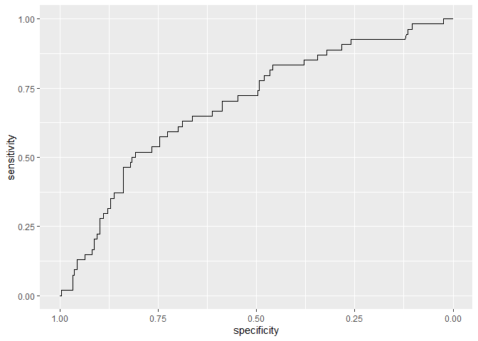

    auc(test_y, predicted)

    ## Setting levels: control = 0, case = 1
    ## Setting direction: controls < cases

    ## Area under the curve: 0.6901

    confusionMatrix(as.factor(as.numeric(predicted > 0.5)), as.factor(test_y))

    ## Confusion Matrix and Statistics
    ## 
    ##           Reference
    ## Prediction   0   1
    ##          0 283  49
    ##          1  13   5
    ##                                           
    ##                Accuracy : 0.8229          
    ##                  95% CI : (0.7787, 0.8614)
    ##     No Information Rate : 0.8457          
    ##     P-Value [Acc > NIR] : 0.8942          
    ##                                           
    ##                   Kappa : 0.0669          
    ##                                           
    ##  Mcnemar's Test P-Value : 8.789e-06       
    ##                                           
    ##             Sensitivity : 0.95608         
    ##             Specificity : 0.09259         
    ##          Pos Pred Value : 0.85241         
    ##          Neg Pred Value : 0.27778         
    ##              Prevalence : 0.84571         
    ##          Detection Rate : 0.80857         
    ##    Detection Prevalence : 0.94857         
    ##       Balanced Accuracy : 0.52434         
    ##                                           
    ##        'Positive' Class : 0               
    ## 

    auc_rr100 <- auc(test_y, predicted)

    ## Setting levels: control = 0, case = 1
    ## Setting direction: controls < cases

#### SLOPE

    ## slope

    res_slope <- SLOPE(train_x_reduced, train_y, family = "binomial", 
                       lambda = "bh", alpha = 0.006)

    predicted <- predict(res_slope, as.matrix(test_x_reduced), type = "response")

    rocobj <- roc(test_y, predicted)

    ## Setting levels: control = 0, case = 1

    ## Setting direction: controls < cases

    ggroc(rocobj)

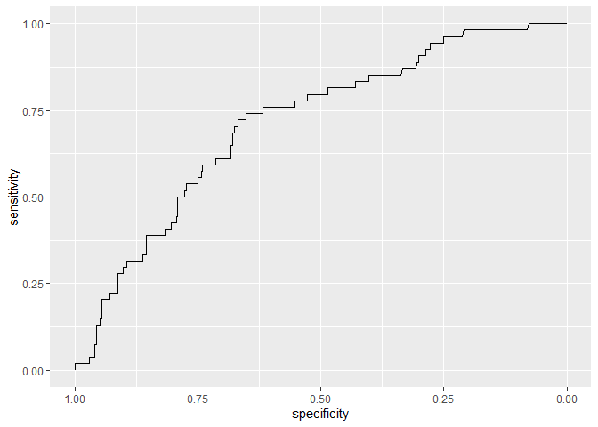

    auc(test_y, predicted)

    ## Setting levels: control = 0, case = 1
    ## Setting direction: controls < cases

    ## Area under the curve: 0.713

    confusionMatrix(as.factor(as.numeric(predicted > 0.5)), as.factor(test_y))

    ## Confusion Matrix and Statistics
    ## 
    ##           Reference
    ## Prediction   0   1
    ##          0 287  52
    ##          1   9   2
    ##                                          
    ##                Accuracy : 0.8257         
    ##                  95% CI : (0.7818, 0.864)
    ##     No Information Rate : 0.8457         
    ##     P-Value [Acc > NIR] : 0.8658         
    ##                                          
    ##                   Kappa : 0.0098         
    ##                                          
    ##  Mcnemar's Test P-Value : 7.551e-08      
    ##                                          
    ##             Sensitivity : 0.96959        
    ##             Specificity : 0.03704        
    ##          Pos Pred Value : 0.84661        
    ##          Neg Pred Value : 0.18182        
    ##              Prevalence : 0.84571        
    ##          Detection Rate : 0.82000        
    ##    Detection Prevalence : 0.96857        
    ##       Balanced Accuracy : 0.50332        
    ##                                          
    ##        'Positive' Class : 0              
    ## 

    auc_s100 <- auc(test_y, predicted)

    ## Setting levels: control = 0, case = 1
    ## Setting direction: controls < cases

### 1000 zmiennych

    # 1000

    candidates <- ranking[1:1000]

    train_x_reduced <- as.matrix(train_x[, candidates])
    test_x_reduced <- as.matrix(test_x[, candidates])

#### LASSO

    # lassso

    lasso_cv <- cv.glmnet(train_x_reduced, train_y, family = "binomial")

    lambda_min <- lasso_cv$lambda.min

    lasso_res <- glmnet(train_x_reduced, train_y, family = "binomial",
                        lambda = lambda_min, thresh = 10^(-10), maxit = 10^(8))

    predicted <- predict.glmnet(lasso_res, newx = as.matrix(test_x_reduced), type = "response")
    predicted <- as.vector(inv_logit(predicted))

    rocobj <- roc(test_y, as.vector(predicted))

    ## Setting levels: control = 0, case = 1

    ## Setting direction: controls < cases

    ggroc(rocobj)

    auc(test_y, predicted)

    ## Setting levels: control = 0, case = 1
    ## Setting direction: controls < cases

    ## Area under the curve: 0.7078

    confusionMatrix(as.factor(as.numeric(predicted > 0.5)), as.factor(test_y))

    ## Confusion Matrix and Statistics
    ## 
    ##           Reference
    ## Prediction   0   1
    ##          0 286  51
    ##          1  10   3
    ##                                          
    ##                Accuracy : 0.8257         
    ##                  95% CI : (0.7818, 0.864)
    ##     No Information Rate : 0.8457         
    ##     P-Value [Acc > NIR] : 0.8658         
    ##                                          
    ##                   Kappa : 0.0316         
    ##                                          
    ##  Mcnemar's Test P-Value : 3.032e-07      
    ##                                          
    ##             Sensitivity : 0.96622        
    ##             Specificity : 0.05556        
    ##          Pos Pred Value : 0.84866        
    ##          Neg Pred Value : 0.23077        
    ##              Prevalence : 0.84571        
    ##          Detection Rate : 0.81714        
    ##    Detection Prevalence : 0.96286        
    ##       Balanced Accuracy : 0.51089        
    ##                                          
    ##        'Positive' Class : 0              
    ## 

    auc_lasso1000 <- auc(test_y, predicted)

    ## Setting levels: control = 0, case = 1
    ## Setting direction: controls < cases

#### Elastic Net

    # elastic net

    elastic_net <- glmnet(train_x_reduced, train_y, family = "binomial", 
                          alpha = 0.5, lambda = lambda_min, thresh = 10^(-10), 
                          maxit = 10^(8))

    predicted <- predict.glmnet(elastic_net, newx = as.matrix(test_x_reduced), type = "response")
    predicted <- as.vector(apply(predicted, 2, inv_logit))

    rocobj <- roc(test_y, predicted)

    ## Setting levels: control = 0, case = 1

    ## Setting direction: controls < cases

    ggroc(rocobj)

    auc(test_y, predicted)

    ## Setting levels: control = 0, case = 1
    ## Setting direction: controls < cases

    ## Area under the curve: 0.6839

    confusionMatrix(as.factor(as.numeric(predicted > 0.5)), as.factor(test_y))

    ## Confusion Matrix and Statistics
    ## 
    ##           Reference
    ## Prediction   0   1
    ##          0 281  50
    ##          1  15   4
    ##                                           
    ##                Accuracy : 0.8143          
    ##                  95% CI : (0.7695, 0.8536)
    ##     No Information Rate : 0.8457          
    ##     P-Value [Acc > NIR] : 0.9528          
    ##                                           
    ##                   Kappa : 0.0318          
    ##                                           
    ##  Mcnemar's Test P-Value : 2.474e-05       
    ##                                           
    ##             Sensitivity : 0.94932         
    ##             Specificity : 0.07407         
    ##          Pos Pred Value : 0.84894         
    ##          Neg Pred Value : 0.21053         
    ##              Prevalence : 0.84571         
    ##          Detection Rate : 0.80286         
    ##    Detection Prevalence : 0.94571         
    ##       Balanced Accuracy : 0.51170         
    ##                                           
    ##        'Positive' Class : 0               
    ## 

    auc_en1000 <- auc(test_y, predicted)

    ## Setting levels: control = 0, case = 1
    ## Setting direction: controls < cases

#### Elastic Net

    # ridge

    ridge <- glmnet(train_x_reduced, train_y, family = "binomial", 
                    lambda = lambda_min, alpha = 0, thresh = 10^(-10), maxit = 10^(8))

    predicted <- predict.glmnet(ridge, newx = as.matrix(test_x_reduced), type = "response")
    predicted <- as.vector(apply(predicted, 2, inv_logit))

    rocobj <- roc(test_y, predicted)

    ## Setting levels: control = 0, case = 1

    ## Setting direction: controls < cases

    ggroc(rocobj)

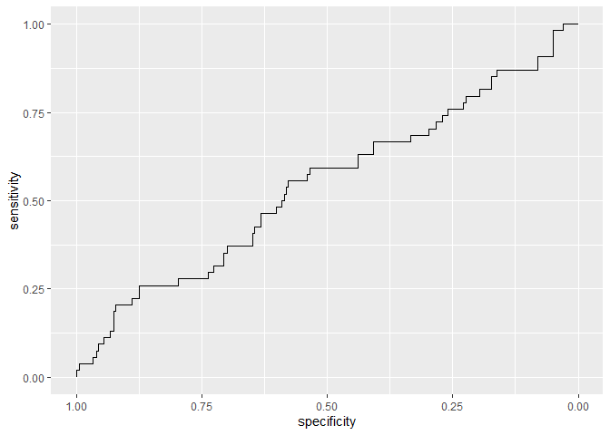

    auc(test_y, predicted)

    ## Setting levels: control = 0, case = 1
    ## Setting direction: controls < cases

    ## Area under the curve: 0.5409

    confusionMatrix(as.factor(as.numeric(predicted > 0.5)), as.factor(test_y))

    ## Confusion Matrix and Statistics
    ## 
    ##           Reference
    ## Prediction   0   1
    ##          0 272  43
    ##          1  24  11
    ##                                           
    ##                Accuracy : 0.8086          
    ##                  95% CI : (0.7634, 0.8485)
    ##     No Information Rate : 0.8457          
    ##     P-Value [Acc > NIR] : 0.97456         
    ##                                           
    ##                   Kappa : 0.1432          
    ##                                           
    ##  Mcnemar's Test P-Value : 0.02787         
    ##                                           
    ##             Sensitivity : 0.9189          
    ##             Specificity : 0.2037          
    ##          Pos Pred Value : 0.8635          
    ##          Neg Pred Value : 0.3143          
    ##              Prevalence : 0.8457          
    ##          Detection Rate : 0.7771          
    ##    Detection Prevalence : 0.9000          
    ##       Balanced Accuracy : 0.5613          
    ##                                           
    ##        'Positive' Class : 0               
    ## 

    auc_rr1000 <- auc(test_y, predicted)

    ## Setting levels: control = 0, case = 1
    ## Setting direction: controls < cases

#### SLOPE

    ## slope

    res_slope <- SLOPE(train_x_reduced, train_y, family = "binomial", 
                       lambda = "bh", alpha = 0.006)

    predicted <- predict(res_slope, as.matrix(test_x_reduced), type = "response")

    rocobj <- roc(test_y, predicted)

    ## Setting levels: control = 0, case = 1

    ## Setting direction: controls < cases

    ggroc(rocobj)

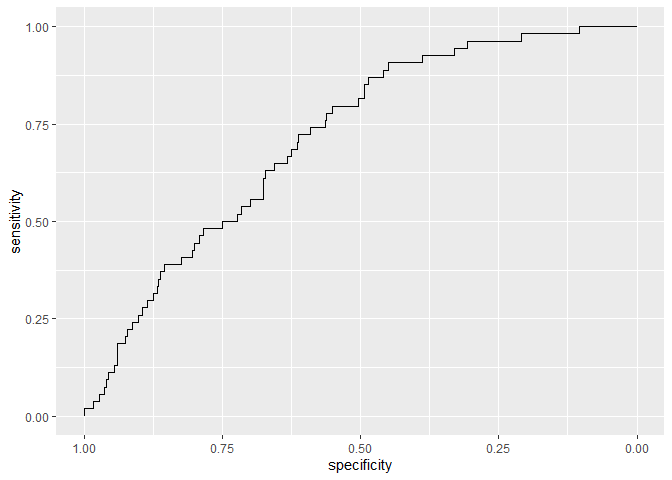

    auc(test_y, predicted)

    ## Setting levels: control = 0, case = 1
    ## Setting direction: controls < cases

    ## Area under the curve: 0.7146

    confusionMatrix(as.factor(as.numeric(predicted > 0.5)), as.factor(test_y))

    ## Confusion Matrix and Statistics
    ## 
    ##           Reference
    ## Prediction   0   1
    ##          0 288  51
    ##          1   8   3
    ##                                          
    ##                Accuracy : 0.8314         
    ##                  95% CI : (0.788, 0.8691)
    ##     No Information Rate : 0.8457         
    ##     P-Value [Acc > NIR] : 0.7938         
    ##                                          
    ##                   Kappa : 0.0423         
    ##                                          
    ##  Mcnemar's Test P-Value : 4.553e-08      
    ##                                          
    ##             Sensitivity : 0.97297        
    ##             Specificity : 0.05556        
    ##          Pos Pred Value : 0.84956        
    ##          Neg Pred Value : 0.27273        
    ##              Prevalence : 0.84571        
    ##          Detection Rate : 0.82286        
    ##    Detection Prevalence : 0.96857        
    ##       Balanced Accuracy : 0.51426        
    ##                                          
    ##        'Positive' Class : 0              
    ## 

    auc_s1000 <- auc(test_y, predicted)

    ## Setting levels: control = 0, case = 1
    ## Setting direction: controls < cases

### 3000

    ################

    # 3000

    candidates <- ranking[1:3000]

    train_x_reduced <- as.matrix(train_x[, candidates])
    test_x_reduced <- as.matrix(test_x[, candidates])

#### LASSO

    # lassso

    lasso_cv <- cv.glmnet(train_x_reduced, train_y, family = "binomial")

    lambda_min <- lasso_cv$lambda.min

    lasso_res <- glmnet(train_x_reduced, train_y, family = "binomial",
                        lambda = lambda_min, thresh = 10^(-10), maxit = 10^(8))

    predicted <- predict.glmnet(lasso_res, newx = as.matrix(test_x_reduced), type = "response")
    predicted <- as.vector(inv_logit(predicted))

    rocobj <- roc(test_y, as.vector(predicted))

    ## Setting levels: control = 0, case = 1

    ## Setting direction: controls < cases

    ggroc(rocobj)

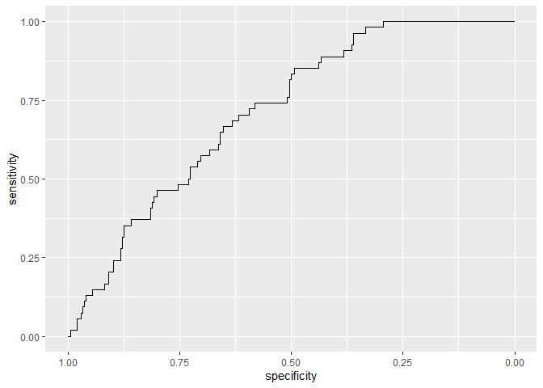

    auc(test_y, predicted)

    ## Setting levels: control = 0, case = 1
    ## Setting direction: controls < cases

    ## Area under the curve: 0.7137

    confusionMatrix(as.factor(as.numeric(predicted > 0.5)), as.factor(test_y))

    ## Confusion Matrix and Statistics
    ## 
    ##           Reference
    ## Prediction   0   1
    ##          0 287  50
    ##          1   9   4
    ##                                          
    ##                Accuracy : 0.8314         
    ##                  95% CI : (0.788, 0.8691)
    ##     No Information Rate : 0.8457         
    ##     P-Value [Acc > NIR] : 0.7938         
    ##                                          
    ##                   Kappa : 0.0633         
    ##                                          
    ##  Mcnemar's Test P-Value : 1.913e-07      
    ##                                          
    ##             Sensitivity : 0.96959        
    ##             Specificity : 0.07407        
    ##          Pos Pred Value : 0.85163        
    ##          Neg Pred Value : 0.30769        
    ##              Prevalence : 0.84571        
    ##          Detection Rate : 0.82000        
    ##    Detection Prevalence : 0.96286        
    ##       Balanced Accuracy : 0.52183        
    ##                                          
    ##        'Positive' Class : 0              
    ## 

    auc_lasso3000 <- auc(test_y, predicted)

    ## Setting levels: control = 0, case = 1
    ## Setting direction: controls < cases

#### Elastic net

    # elastic net

    elastic_net <- glmnet(train_x_reduced, train_y, family = "binomial", 
                          alpha = 0.5, lambda = lambda_min, thresh = 10^(-10), 
                          maxit = 10^(8))

    predicted <- predict.glmnet(elastic_net, newx = as.matrix(test_x_reduced), type = "response")
    predicted <- as.vector(apply(predicted, 2, inv_logit))

    rocobj <- roc(test_y, predicted)

    ## Setting levels: control = 0, case = 1

    ## Setting direction: controls < cases

    ggroc(rocobj)

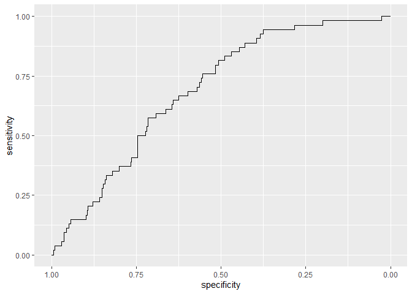

    auc(test_y, predicted)

    ## Setting levels: control = 0, case = 1
    ## Setting direction: controls < cases

    ## Area under the curve: 0.6906

    confusionMatrix(as.factor(as.numeric(predicted > 0.5)), as.factor(test_y))

    ## Confusion Matrix and Statistics
    ## 
    ##           Reference
    ## Prediction   0   1
    ##          0 281  47
    ##          1  15   7
    ##                                           
    ##                Accuracy : 0.8229          
    ##                  95% CI : (0.7787, 0.8614)
    ##     No Information Rate : 0.8457          
    ##     P-Value [Acc > NIR] : 0.8942          
    ##                                           
    ##                   Kappa : 0.1042          
    ##                                           
    ##  Mcnemar's Test P-Value : 8.251e-05       
    ##                                           
    ##             Sensitivity : 0.9493          
    ##             Specificity : 0.1296          
    ##          Pos Pred Value : 0.8567          
    ##          Neg Pred Value : 0.3182          
    ##              Prevalence : 0.8457          
    ##          Detection Rate : 0.8029          
    ##    Detection Prevalence : 0.9371          
    ##       Balanced Accuracy : 0.5395          
    ##                                           
    ##        'Positive' Class : 0               
    ## 

    auc_en3000 <- auc(test_y, predicted)

    ## Setting levels: control = 0, case = 1
    ## Setting direction: controls < cases

#### ridge

    # ridge

    ridge <- glmnet(train_x_reduced, train_y, family = "binomial", 
                    lambda = lambda_min, alpha = 0, thresh = 10^(-10), maxit = 10^(8))

    predicted <- predict.glmnet(ridge, newx = as.matrix(test_x_reduced), type = "response")
    predicted <- as.vector(apply(predicted, 2, inv_logit))

    rocobj <- roc(test_y, predicted)

    ## Setting levels: control = 0, case = 1

    ## Setting direction: controls < cases

    ggroc(rocobj)

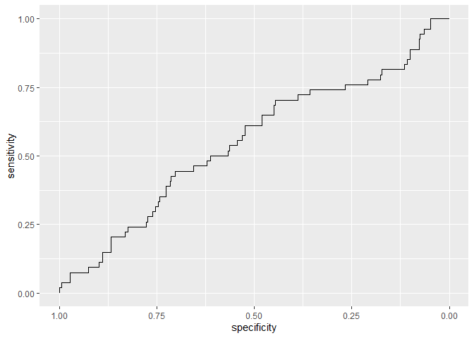

    auc(test_y, predicted)

    ## Setting levels: control = 0, case = 1
    ## Setting direction: controls < cases

    ## Area under the curve: 0.5513

    confusionMatrix(as.factor(as.numeric(predicted > 0.5)), as.factor(test_y))

    ## Confusion Matrix and Statistics
    ## 
    ##           Reference
    ## Prediction   0   1
    ##          0 272  49
    ##          1  24   5
    ##                                          
    ##                Accuracy : 0.7914         
    ##                  95% CI : (0.745, 0.8328)
    ##     No Information Rate : 0.8457         
    ##     P-Value [Acc > NIR] : 0.99727        
    ##                                          
    ##                   Kappa : 0.0142         
    ##                                          
    ##  Mcnemar's Test P-Value : 0.00497        
    ##                                          
    ##             Sensitivity : 0.91892        
    ##             Specificity : 0.09259        
    ##          Pos Pred Value : 0.84735        
    ##          Neg Pred Value : 0.17241        
    ##              Prevalence : 0.84571        
    ##          Detection Rate : 0.77714        
    ##    Detection Prevalence : 0.91714        
    ##       Balanced Accuracy : 0.50576        
    ##                                          
    ##        'Positive' Class : 0              
    ## 

    auc_rr3000 <- auc(test_y, predicted)

    ## Setting levels: control = 0, case = 1
    ## Setting direction: controls < cases

#### SLOPE

    ## slope

    res_slope <- SLOPE(train_x_reduced, train_y, family = "binomial", 
                       lambda = "bh", alpha = 0.006)

    predicted <- predict(res_slope, as.matrix(test_x_reduced), type = "response")

    rocobj <- roc(test_y, predicted)

    ## Setting levels: control = 0, case = 1

    ## Setting direction: controls < cases

    ggroc(rocobj)

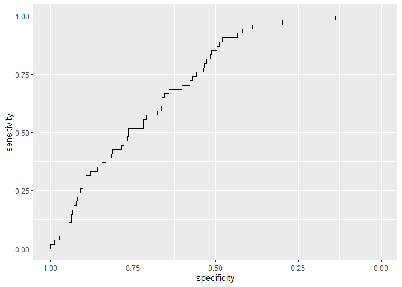

    auc(test_y, predicted)

    ## Setting levels: control = 0, case = 1
    ## Setting direction: controls < cases

    ## Area under the curve: 0.7223

    confusionMatrix(as.factor(as.numeric(predicted > 0.5)), as.factor(test_y))

    ## Confusion Matrix and Statistics
    ## 
    ##           Reference
    ## Prediction   0   1
    ##          0 290  52
    ##          1   6   2
    ##                                           
    ##                Accuracy : 0.8343          
    ##                  95% CI : (0.7911, 0.8717)
    ##     No Information Rate : 0.8457          
    ##     P-Value [Acc > NIR] : 0.7503          
    ##                                           
    ##                   Kappa : 0.0257          
    ##                                           
    ##  Mcnemar's Test P-Value : 3.446e-09       
    ##                                           
    ##             Sensitivity : 0.97973         
    ##             Specificity : 0.03704         
    ##          Pos Pred Value : 0.84795         
    ##          Neg Pred Value : 0.25000         
    ##              Prevalence : 0.84571         
    ##          Detection Rate : 0.82857         
    ##    Detection Prevalence : 0.97714         
    ##       Balanced Accuracy : 0.50838         
    ##                                           
    ##        'Positive' Class : 0               
    ## 

    auc_s3000 <- auc(test_y, predicted)

    ## Setting levels: control = 0, case = 1
    ## Setting direction: controls < cases

### 5000

    ################

    # 5000

    candidates <- ranking[1:5000]

    train_x_reduced <- as.matrix(train_x[, candidates])
    test_x_reduced <- as.matrix(test_x[, candidates])

#### LASSO

    # lassso

    lasso_cv <- cv.glmnet(train_x_reduced, train_y, family = "binomial")

    lambda_min <- lasso_cv$lambda.min

    lasso_res <- glmnet(train_x_reduced, train_y, family = "binomial",
                        lambda = lambda_min, thresh = 10^(-10), maxit = 10^(8))

    predicted <- predict.glmnet(lasso_res, newx = as.matrix(test_x_reduced), type = "response")
    predicted <- as.vector(inv_logit(predicted))

    rocobj <- roc(test_y, as.vector(predicted))

    ## Setting levels: control = 0, case = 1

    ## Setting direction: controls < cases

    ggroc(rocobj)

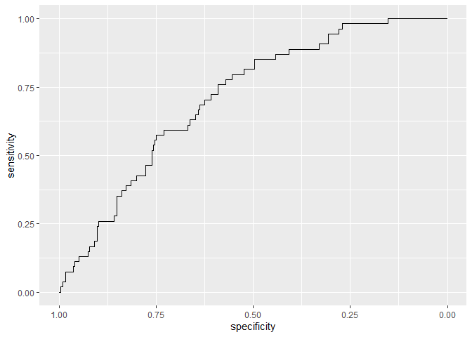

    auc(test_y, predicted)

    ## Setting levels: control = 0, case = 1
    ## Setting direction: controls < cases

    ## Area under the curve: 0.7106

    confusionMatrix(as.factor(as.numeric(predicted > 0.5)), as.factor(test_y))

    ## Confusion Matrix and Statistics
    ## 
    ##           Reference
    ## Prediction   0   1
    ##          0 287  50
    ##          1   9   4
    ##                                          
    ##                Accuracy : 0.8314         
    ##                  95% CI : (0.788, 0.8691)
    ##     No Information Rate : 0.8457         
    ##     P-Value [Acc > NIR] : 0.7938         
    ##                                          
    ##                   Kappa : 0.0633         
    ##                                          
    ##  Mcnemar's Test P-Value : 1.913e-07      
    ##                                          
    ##             Sensitivity : 0.96959        
    ##             Specificity : 0.07407        
    ##          Pos Pred Value : 0.85163        
    ##          Neg Pred Value : 0.30769        
    ##              Prevalence : 0.84571        
    ##          Detection Rate : 0.82000        
    ##    Detection Prevalence : 0.96286        
    ##       Balanced Accuracy : 0.52183        
    ##                                          
    ##        'Positive' Class : 0              
    ## 

    auc_lasso5000 <- auc(test_y, predicted)

    ## Setting levels: control = 0, case = 1
    ## Setting direction: controls < cases

#### Elastic net

    # elastic net

    elastic_net <- glmnet(train_x_reduced, train_y, family = "binomial", 
                          alpha = 0.5, lambda = lambda_min, thresh = 10^(-10), 
                          maxit = 10^(8))

    predicted <- predict.glmnet(elastic_net, newx = as.matrix(test_x_reduced), type = "response")
    predicted <- as.vector(apply(predicted, 2, inv_logit))

    rocobj <- roc(test_y, predicted)

    ## Setting levels: control = 0, case = 1

    ## Setting direction: controls < cases

    ggroc(rocobj)

    auc(test_y, predicted)

    ## Setting levels: control = 0, case = 1
    ## Setting direction: controls < cases

    ## Area under the curve: 0.7018

    confusionMatrix(as.factor(as.numeric(predicted > 0.5)), as.factor(test_y))

    ## Confusion Matrix and Statistics
    ## 
    ##           Reference
    ## Prediction   0   1
    ##          0 281  50
    ##          1  15   4
    ##                                           
    ##                Accuracy : 0.8143          
    ##                  95% CI : (0.7695, 0.8536)
    ##     No Information Rate : 0.8457          
    ##     P-Value [Acc > NIR] : 0.9528          
    ##                                           
    ##                   Kappa : 0.0318          
    ##                                           
    ##  Mcnemar's Test P-Value : 2.474e-05       
    ##                                           
    ##             Sensitivity : 0.94932         
    ##             Specificity : 0.07407         
    ##          Pos Pred Value : 0.84894         
    ##          Neg Pred Value : 0.21053         
    ##              Prevalence : 0.84571         
    ##          Detection Rate : 0.80286         
    ##    Detection Prevalence : 0.94571         
    ##       Balanced Accuracy : 0.51170         
    ##                                           
    ##        'Positive' Class : 0               
    ## 

    auc_en5000 <- auc(test_y, predicted)

    ## Setting levels: control = 0, case = 1
    ## Setting direction: controls < cases

    # ridge

    # ridge <- glmnet(train_x_reduced, train_y, family = "binomial", 
    #                 lambda = lambda_min, alpha = 0, thresh = 10^(-10), maxit = 10^(8))
    # 
    # predicted <- predict.glmnet(ridge, newx = as.matrix(test_x_reduced), type = "response")
    # predicted <- as.vector(apply(predicted, 2, inv_logit))
    # 
    # rocobj <- roc(test_y, predicted)
    # ggroc(rocobj)
    # auc(test_y, predicted)
    # confusionMatrix(as.factor(as.numeric(predicted > 0.5)), as.factor(test_y))
    auc_rr5000 <- NA

#### SLOPE

    ## slope

    res_slope <- SLOPE(train_x_reduced, train_y, family = "binomial", 
                       lambda = "bh", alpha = 0.006)

    predicted <- predict(res_slope, as.matrix(test_x_reduced), type = "response")

    rocobj <- roc(test_y, predicted)

    ## Setting levels: control = 0, case = 1

    ## Setting direction: controls < cases

    ggroc(rocobj)

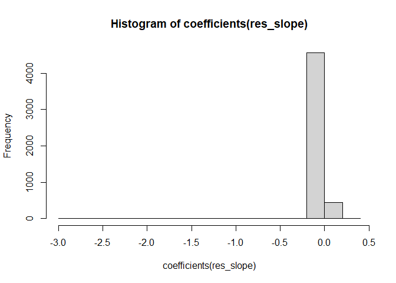

    auc(test_y, predicted)

    ## Setting levels: control = 0, case = 1
    ## Setting direction: controls < cases

    ## Area under the curve: 0.7277

    confusionMatrix(as.factor(as.numeric(predicted > 0.5)), as.factor(test_y))

    ## Confusion Matrix and Statistics
    ## 
    ##           Reference
    ## Prediction   0   1
    ##          0 289  52
    ##          1   7   2
    ##                                          
    ##                Accuracy : 0.8314         
    ##                  95% CI : (0.788, 0.8691)
    ##     No Information Rate : 0.8457         
    ##     P-Value [Acc > NIR] : 0.7938         
    ##                                          
    ##                   Kappa : 0.0203         
    ##                                          
    ##  Mcnemar's Test P-Value : 1.014e-08      
    ##                                          
    ##             Sensitivity : 0.97635        
    ##             Specificity : 0.03704        
    ##          Pos Pred Value : 0.84751        
    ##          Neg Pred Value : 0.22222        
    ##              Prevalence : 0.84571        
    ##          Detection Rate : 0.82571        
    ##    Detection Prevalence : 0.97429        
    ##       Balanced Accuracy : 0.50669        
    ##                                          
    ##        'Positive' Class : 0              
    ## 

    auc_s5000 <- auc(test_y, predicted)

    ## Setting levels: control = 0, case = 1
    ## Setting direction: controls < cases

    candidates <- ranking[1:10000]

    train_x_reduced <- as.matrix(train_x[, candidates])
    test_x_reduced <- as.matrix(test_x[, candidates])

    res_slope <- SLOPE(train_x_reduced, train_y, family = "binomial", 
                       lambda = "bh", alpha = 0.006)

    predicted <- predict(res_slope, as.matrix(test_x_reduced), type = "response")

    rocobj <- roc(test_y, predicted)

    ## Setting levels: control = 0, case = 1

    ## Setting direction: controls < cases

    ggroc(rocobj)

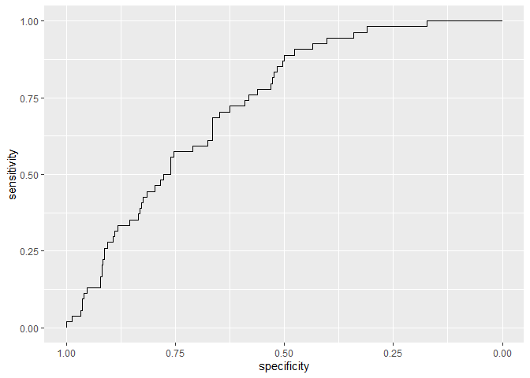

    auc(test_y, predicted)

    ## Setting levels: control = 0, case = 1
    ## Setting direction: controls < cases

    ## Area under the curve: 0.7306

    confusionMatrix(as.factor(as.numeric(predicted > 0.5)), as.factor(test_y))

    ## Confusion Matrix and Statistics
    ## 
    ##           Reference
    ## Prediction   0   1
    ##          0 289  52
    ##          1   7   2
    ##                                          
    ##                Accuracy : 0.8314         
    ##                  95% CI : (0.788, 0.8691)
    ##     No Information Rate : 0.8457         
    ##     P-Value [Acc > NIR] : 0.7938         
    ##                                          
    ##                   Kappa : 0.0203         
    ##                                          
    ##  Mcnemar's Test P-Value : 1.014e-08      
    ##                                          
    ##             Sensitivity : 0.97635        
    ##             Specificity : 0.03704        
    ##          Pos Pred Value : 0.84751        
    ##          Neg Pred Value : 0.22222        
    ##              Prevalence : 0.84571        
    ##          Detection Rate : 0.82571        
    ##    Detection Prevalence : 0.97429        
    ##       Balanced Accuracy : 0.50669        
    ##                                          
    ##        'Positive' Class : 0              
    ## 

    auc_s10000 <- auc(test_y, predicted)

    ## Setting levels: control = 0, case = 1
    ## Setting direction: controls < cases

    data.frame(models = c("lasso", "elastic net", "ridge", "slope"),
               `100` = c(auc_lasso100, auc_en100, auc_rr100, auc_s100),
               `1000` = c(auc_lasso1000, auc_en1000, auc_rr1000, auc_s1000),
               `3000` = c(auc_lasso3000, auc_en3000, auc_rr3000, auc_s3000),
               `5000` = c(auc_lasso5000, auc_en5000, auc_rr5000, auc_s5000)) %>% 
      kable()

<table>
<thead>
<tr class="header">
<th style="text-align: left;">models</th>
<th style="text-align: right;">X100</th>
<th style="text-align: right;">X1000</th>
<th style="text-align: right;">X3000</th>
<th style="text-align: right;">X5000</th>
</tr>
</thead>
<tbody>
<tr class="odd">
<td style="text-align: left;">lasso</td>
<td style="text-align: right;">0.7073323</td>
<td style="text-align: right;">0.7078328</td>
<td style="text-align: right;">0.7136512</td>
<td style="text-align: right;">0.7105856</td>
</tr>
<tr class="even">
<td style="text-align: left;">elastic net</td>
<td style="text-align: right;">0.7024837</td>
<td style="text-align: right;">0.6839339</td>
<td style="text-align: right;">0.6905656</td>
<td style="text-align: right;">0.7018268</td>
</tr>
<tr class="odd">
<td style="text-align: left;">ridge</td>
<td style="text-align: right;">0.6900963</td>
<td style="text-align: right;">0.5408534</td>
<td style="text-align: right;">0.5513013</td>
<td style="text-align: right;">NA</td>
</tr>
<tr class="even">
<td style="text-align: left;">slope</td>
<td style="text-align: right;">0.7129630</td>
<td style="text-align: right;">0.7145896</td>
<td style="text-align: right;">0.7223473</td>
<td style="text-align: right;">0.7277277</td>
</tr>
</tbody>
</table>

## SLOPE 10000 zmiennych

    candidates <- ranking[1:10000]

    train_x_reduced <- as.matrix(train_x[, candidates])
    test_x_reduced <- as.matrix(test_x[, candidates])

    res_slope <- SLOPE(train_x_reduced, train_y, family = "binomial",
                       lambda = "bh", alpha = 0.006)

    predicted <- predict(res_slope, as.matrix(test_x_reduced), type = "response")

    rocobj <- roc(test_y, predicted)

    ## Setting levels: control = 0, case = 1

    ## Setting direction: controls < cases

    ggroc(rocobj)

    auc(test_y, predicted)

    ## Setting levels: control = 0, case = 1
    ## Setting direction: controls < cases

    ## Area under the curve: 0.7306

    confusionMatrix(as.factor(as.numeric(predicted > 0.5)), as.factor(test_y))

    ## Confusion Matrix and Statistics
    ## 
    ##           Reference
    ## Prediction   0   1
    ##          0 289  52
    ##          1   7   2
    ##                                          
    ##                Accuracy : 0.8314         
    ##                  95% CI : (0.788, 0.8691)
    ##     No Information Rate : 0.8457         
    ##     P-Value [Acc > NIR] : 0.7938         
    ##                                          
    ##                   Kappa : 0.0203         
    ##                                          
    ##  Mcnemar's Test P-Value : 1.014e-08      
    ##                                          
    ##             Sensitivity : 0.97635        
    ##             Specificity : 0.03704        
    ##          Pos Pred Value : 0.84751        
    ##          Neg Pred Value : 0.22222        
    ##              Prevalence : 0.84571        
    ##          Detection Rate : 0.82571        
    ##    Detection Prevalence : 0.97429        
    ##       Balanced Accuracy : 0.50669        
    ##                                          
    ##        'Positive' Class : 0              
    ## 

# Podsumowanie

1.  Bardzo dużo fałszywych negatywnych predykcji (klasa pozytywna jest
    mała)

2.  Do zmiennych wybranych przez mBIC2 nie mogę dobrać zmiennych
    skorelowanych (nie ma korelacji większych lub równych 0.8)

3.  Pytanie: czy rozszerzyć przestrzeń k-merową? Może wśród rozważanych
    k-merów nie ma nic istotnego

4.  Z narzędzi regularyzacyjnych najlepiej działa SLOPE, ale różnica
    pomiędzy LASSO i SLOPEm jest niewielka.

<!-- -->

    # library(xgboost)
    # 
    # #### xgboost
    # 
    # chosen_kmers <- readRDS("../mbic_vars.RDS")
    # train_x_reduced <- as.matrix(train_x[, chosen_kmers])
    # test_x_reduced <- as.matrix(test_x[, chosen_kmers])
    # 
    # res_xgboost <- xgboost(data = train_x_reduced, label = train_y, max.depth = 2, eta = 1, 
    #         nthread = 2, nrounds = 2, objective = "binary:logistic")
    # 
    # predicted <- predict(res_xgboost, test_x_reduced)
    # 
    # rocobj <- roc(test_y, predicted)
    # ggroc(rocobj)
    # auc(test_y, predicted)
    # confusionMatrix(as.factor(as.numeric(predicted > 0.5)), as.factor(test_y))

    # #### random forest
    # 
    # model_rf_small <- ranger(train_y ~ .,
    #                          data = train_x_reduced,
    #                          probability = TRUE)
    # 
    # predicted <- predict(model_rf_small, test_x_reduced)[["predictions"]][, 1]
    # rocobj <- roc(test_y, predicted)
    # ggroc(rocobj)
    # auc(test_y, predicted)
    # confusionMatrix(as.factor(as.numeric(predicted > 0.5)), as.factor(test_y))

    # #### superlearner
    # 
    # library(SuperLearner)
    # 
    # sl <- SuperLearner(Y = train_y, X = train_x_reduced, family = binomial(),
    #                   SL.library = c("SL.mean", "SL.glmnet", "SL.ranger"))
    # 
    # 
    # predicted <- as.vector(unlist(predict(sl, test_x_reduced)$pred))
