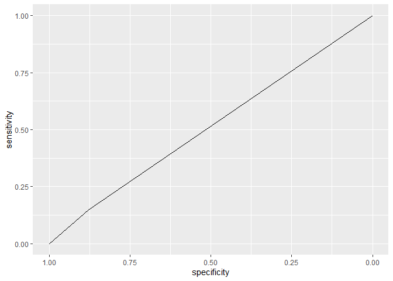

1.  Obniżyć kryterium IC , moze zrobić fast forward

-   mAIC

1.  Rozszerzyć przestrzeń k-merów

2.  Spróbować interakcje rzędu 3 i 4 i może więcej

3.  Zrobić porównanie - wybór najlepszych zmiennych i porównanie co się
    będzie potem działo

-   czy mbic2 wybiera najlepsze zmienne?

1.  -   Spróbować z wagami żeby zbalansować (zobaczyć) - data
        augmantation, oversampling

### Pomysły:

1.  Zrobić ranking z fast forward, wybierać zmienne w oparciu o ranking

<!-- -->

    ## Loading required package: slam

    ## Type 'citation("pROC")' for a citation.

    ## 
    ## Attaching package: 'pROC'

    ## The following objects are masked from 'package:stats':
    ## 
    ##     cov, smooth, var

    ## Loading required package: lattice

    ## 
    ## Attaching package: 'lattice'

    ## The following object is masked from 'package:boot':
    ## 
    ##     melanoma

    ## Registered S3 method overwritten by 'lava':
    ##   method            from      
    ##   print.equivalence partitions

    ## 
    ## Attaching package: 'dplyr'

    ## The following objects are masked from 'package:stats':
    ## 
    ##     filter, lag

    ## The following objects are masked from 'package:base':
    ## 
    ##     intersect, setdiff, setequal, union

    ## Loading required package: Matrix

    ## Loaded glmnet 4.1-8

    ## 
    ## Attaching package: 'tidyr'

    ## The following objects are masked from 'package:Matrix':
    ## 
    ##     expand, pack, unpack

    ## Warning in asMethod(object): sparse->dense coercion: allocating vector of size
    ## 5.3 GiB

### Interakcje 3. rzędu

    get_interactions_design_3 <- function(y, x) {
      lm_model <- lm(y~ (.)^3, data = data.frame(x))
      model.matrix(lm_model)
    }

    chosen_kmers <- readRDS("../mbic_vars.RDS")

    train_x_reduced <- as.matrix(train_x[, chosen_kmers])
    test_x_reduced <- as.matrix(test_x[, chosen_kmers])

    design_matrix_train <- get_interactions_design_3(train_y, train_x_reduced)
    design_matrix_test <- get_interactions_design_3(test_y, test_x_reduced)

    # LASSO

    lasso_cv <- cv.glmnet(design_matrix_train, train_y, family = "binomial")

    lambda_min <- lasso_cv$lambda.min

    lasso_res <- glmnet(design_matrix_train, train_y, family = "binomial",
                        lambda = lambda_min, thresh = 10^(-10), maxit = 10^(8))

    predicted <- predict.glmnet(lasso_res, newx = as.matrix(design_matrix_test), type = "response")
    predicted <- as.vector(inv_logit(predicted))

    rocobj <- roc(test_y, as.vector(predicted))

    ## Setting levels: control = 0, case = 1

    ## Setting direction: controls < cases

    ggroc(rocobj)

    auc(test_y, predicted)

    ## Setting levels: control = 0, case = 1
    ## Setting direction: controls < cases

    ## Area under the curve: 0.7004

    confusionMatrix(as.factor(as.numeric(predicted > 0.5)), as.factor(test_y))

    ## Confusion Matrix and Statistics
    ## 
    ##           Reference
    ## Prediction   0   1
    ##          0 282  49
    ##          1  14   5
    ##                                           
    ##                Accuracy : 0.82            
    ##                  95% CI : (0.7757, 0.8588)
    ##     No Information Rate : 0.8457          
    ##     P-Value [Acc > NIR] : 0.9179          
    ##                                           
    ##                   Kappa : 0.0616          
    ##                                           
    ##  Mcnemar's Test P-Value : 1.839e-05       
    ##                                           
    ##             Sensitivity : 0.95270         
    ##             Specificity : 0.09259         
    ##          Pos Pred Value : 0.85196         
    ##          Neg Pred Value : 0.26316         
    ##              Prevalence : 0.84571         
    ##          Detection Rate : 0.80571         
    ##    Detection Prevalence : 0.94571         
    ##       Balanced Accuracy : 0.52265         
    ##                                           
    ##        'Positive' Class : 0               
    ## 

    # elastic net

    elastic_net <- glmnet(design_matrix_train, train_y, family = "binomial", 
                          alpha = 0.5, lambda = lambda_min, thresh = 10^(-10), 
                          maxit = 10^(8))

    predicted <- predict.glmnet(elastic_net, newx = as.matrix(design_matrix_test), type = "response")
    predicted <- as.vector(apply(predicted, 2, inv_logit))

    rocobj <- roc(test_y, predicted)

    ## Setting levels: control = 0, case = 1
    ## Setting direction: controls < cases

    ggroc(rocobj)

    auc(test_y, predicted)

    ## Setting levels: control = 0, case = 1
    ## Setting direction: controls < cases

    ## Area under the curve: 0.7022

    confusionMatrix(as.factor(as.numeric(predicted > 0.5)), as.factor(test_y))

    ## Confusion Matrix and Statistics
    ## 
    ##           Reference
    ## Prediction   0   1
    ##          0 280  48
    ##          1  16   6
    ##                                           
    ##                Accuracy : 0.8171          
    ##                  95% CI : (0.7726, 0.8562)
    ##     No Information Rate : 0.8457          
    ##     P-Value [Acc > NIR] : 0.9372607       
    ##                                           
    ##                   Kappa : 0.0753          
    ##                                           
    ##  Mcnemar's Test P-Value : 0.0001066       
    ##                                           
    ##             Sensitivity : 0.9459          
    ##             Specificity : 0.1111          
    ##          Pos Pred Value : 0.8537          
    ##          Neg Pred Value : 0.2727          
    ##              Prevalence : 0.8457          
    ##          Detection Rate : 0.8000          
    ##    Detection Prevalence : 0.9371          
    ##       Balanced Accuracy : 0.5285          
    ##                                           
    ##        'Positive' Class : 0               
    ## 

    # ridge

    ridge <- glmnet(design_matrix_train, train_y, family = "binomial", 
                    lambda = lambda_min, alpha = 0, thresh = 10^(-10), maxit = 10^(8))

    predicted <- predict.glmnet(ridge, newx = as.matrix(design_matrix_test), type = "response")
    predicted <- as.vector(apply(predicted, 2, inv_logit))

    rocobj <- roc(test_y, predicted)

    ## Setting levels: control = 0, case = 1
    ## Setting direction: controls < cases

    ggroc(rocobj)

    auc(test_y, predicted)

    ## Setting levels: control = 0, case = 1
    ## Setting direction: controls < cases

    ## Area under the curve: 0.6951

    confusionMatrix(as.factor(as.numeric(predicted > 0.5)), as.factor(test_y))

    ## Confusion Matrix and Statistics
    ## 
    ##           Reference
    ## Prediction   0   1
    ##          0 277  49
    ##          1  19   5
    ##                                           
    ##                Accuracy : 0.8057          
    ##                  95% CI : (0.7603, 0.8459)
    ##     No Information Rate : 0.8457          
    ##     P-Value [Acc > NIR] : 0.9817597       
    ##                                           
    ##                   Kappa : 0.0367          
    ##                                           
    ##  Mcnemar's Test P-Value : 0.0004368       
    ##                                           
    ##             Sensitivity : 0.93581         
    ##             Specificity : 0.09259         
    ##          Pos Pred Value : 0.84969         
    ##          Neg Pred Value : 0.20833         
    ##              Prevalence : 0.84571         
    ##          Detection Rate : 0.79143         
    ##    Detection Prevalence : 0.93143         
    ##       Balanced Accuracy : 0.51420         
    ##                                           
    ##        'Positive' Class : 0               
    ## 

    ## slope

    res_slope <- SLOPE(design_matrix_train, train_y, family = "binomial", 
                       lambda = "bh", alpha = 0.01)

    predicted <- predict(res_slope, as.matrix(design_matrix_test), type = "response")

    rocobj <- roc(test_y, predicted)

    ## Setting levels: control = 0, case = 1
    ## Setting direction: controls < cases

    ggroc(rocobj)

    auc(test_y, predicted)

    ## Setting levels: control = 0, case = 1
    ## Setting direction: controls < cases

    ## Area under the curve: 0.7017

    confusionMatrix(as.factor(as.numeric(predicted > 0.5)), as.factor(test_y))

    ## Confusion Matrix and Statistics
    ## 
    ##           Reference
    ## Prediction   0   1
    ##          0 292  52
    ##          1   4   2
    ##                                           
    ##                Accuracy : 0.84            
    ##                  95% CI : (0.7973, 0.8768)
    ##     No Information Rate : 0.8457          
    ##     P-Value [Acc > NIR] : 0.6497          
    ##                                           
    ##                   Kappa : 0.0369          
    ##                                           
    ##  Mcnemar's Test P-Value : 3.372e-10       
    ##                                           
    ##             Sensitivity : 0.98649         
    ##             Specificity : 0.03704         
    ##          Pos Pred Value : 0.84884         
    ##          Neg Pred Value : 0.33333         
    ##              Prevalence : 0.84571         
    ##          Detection Rate : 0.83429         
    ##    Detection Prevalence : 0.98286         
    ##       Balanced Accuracy : 0.51176         
    ##                                           
    ##        'Positive' Class : 0               
    ## 

### Interakcja 4. rzędu

    get_interactions_design_4 <- function(y, x) {
      lm_model <- lm(y~ (.)^4, data = data.frame(x))
      model.matrix(lm_model)
    }

    design_matrix_train <- get_interactions_design_4(train_y, train_x_reduced)
    design_matrix_test <- get_interactions_design_4(test_y, test_x_reduced)

    # LASSO

    lasso_cv <- cv.glmnet(design_matrix_train, train_y, family = "binomial")

    lambda_min <- lasso_cv$lambda.min

    lasso_res <- glmnet(design_matrix_train, train_y, family = "binomial",
                        lambda = lambda_min, thresh = 10^(-10), maxit = 10^(8))

    predicted <- predict.glmnet(lasso_res, newx = as.matrix(design_matrix_test), type = "response")
    predicted <- as.vector(inv_logit(predicted))

    rocobj <- roc(test_y, as.vector(predicted))

    ## Setting levels: control = 0, case = 1

    ## Setting direction: controls < cases

    ggroc(rocobj)

    auc(test_y, predicted)

    ## Setting levels: control = 0, case = 1
    ## Setting direction: controls < cases

    ## Area under the curve: 0.7019

    confusionMatrix(as.factor(as.numeric(predicted > 0.5)), as.factor(test_y))

    ## Confusion Matrix and Statistics
    ## 
    ##           Reference
    ## Prediction   0   1
    ##          0 280  49
    ##          1  16   5
    ##                                           
    ##                Accuracy : 0.8143          
    ##                  95% CI : (0.7695, 0.8536)
    ##     No Information Rate : 0.8457          
    ##     P-Value [Acc > NIR] : 0.9528          
    ##                                           
    ##                   Kappa : 0.0514          
    ##                                           
    ##  Mcnemar's Test P-Value : 7.214e-05       
    ##                                           
    ##             Sensitivity : 0.94595         
    ##             Specificity : 0.09259         
    ##          Pos Pred Value : 0.85106         
    ##          Neg Pred Value : 0.23810         
    ##              Prevalence : 0.84571         
    ##          Detection Rate : 0.80000         
    ##    Detection Prevalence : 0.94000         
    ##       Balanced Accuracy : 0.51927         
    ##                                           
    ##        'Positive' Class : 0               
    ## 

    # elastic net

    elastic_net <- glmnet(design_matrix_train, train_y, family = "binomial", 
                          alpha = 0.5, lambda = lambda_min, thresh = 10^(-10), 
                          maxit = 10^(8))

    predicted <- predict.glmnet(elastic_net, newx = as.matrix(design_matrix_test), type = "response")
    predicted <- as.vector(apply(predicted, 2, inv_logit))

    rocobj <- roc(test_y, predicted)

    ## Setting levels: control = 0, case = 1
    ## Setting direction: controls < cases

    ggroc(rocobj)

    auc(test_y, predicted)

    ## Setting levels: control = 0, case = 1
    ## Setting direction: controls < cases

    ## Area under the curve: 0.7012

    confusionMatrix(as.factor(as.numeric(predicted > 0.5)), as.factor(test_y))

    ## Confusion Matrix and Statistics
    ## 
    ##           Reference
    ## Prediction   0   1
    ##          0 281  48
    ##          1  15   6
    ##                                           
    ##                Accuracy : 0.82            
    ##                  95% CI : (0.7757, 0.8588)
    ##     No Information Rate : 0.8457          
    ##     P-Value [Acc > NIR] : 0.9179          
    ##                                           
    ##                   Kappa : 0.0806          
    ##                                           
    ##  Mcnemar's Test P-Value : 5.539e-05       
    ##                                           
    ##             Sensitivity : 0.9493          
    ##             Specificity : 0.1111          
    ##          Pos Pred Value : 0.8541          
    ##          Neg Pred Value : 0.2857          
    ##              Prevalence : 0.8457          
    ##          Detection Rate : 0.8029          
    ##    Detection Prevalence : 0.9400          
    ##       Balanced Accuracy : 0.5302          
    ##                                           
    ##        'Positive' Class : 0               
    ## 

    # ridge

    ridge <- glmnet(design_matrix_train, train_y, family = "binomial", 
                    lambda = lambda_min, alpha = 0, thresh = 10^(-10), maxit = 10^(8))

    predicted <- predict.glmnet(ridge, newx = as.matrix(design_matrix_test), type = "response")
    predicted <- as.vector(apply(predicted, 2, inv_logit))

    rocobj <- roc(test_y, predicted)

    ## Setting levels: control = 0, case = 1
    ## Setting direction: controls < cases

    ggroc(rocobj)

    auc(test_y, predicted)

    ## Setting levels: control = 0, case = 1
    ## Setting direction: controls < cases

    ## Area under the curve: 0.6873

    confusionMatrix(as.factor(as.numeric(predicted > 0.5)), as.factor(test_y))

    ## Confusion Matrix and Statistics
    ## 
    ##           Reference
    ## Prediction   0   1
    ##          0 275  49
    ##          1  21   5
    ##                                           
    ##                Accuracy : 0.8             
    ##                  95% CI : (0.7542, 0.8406)
    ##     No Information Rate : 0.8457          
    ##     P-Value [Acc > NIR] : 0.99106         
    ##                                           
    ##                   Kappa : 0.0275          
    ##                                           
    ##  Mcnemar's Test P-Value : 0.00125         
    ##                                           
    ##             Sensitivity : 0.92905         
    ##             Specificity : 0.09259         
    ##          Pos Pred Value : 0.84877         
    ##          Neg Pred Value : 0.19231         
    ##              Prevalence : 0.84571         
    ##          Detection Rate : 0.78571         
    ##    Detection Prevalence : 0.92571         
    ##       Balanced Accuracy : 0.51082         
    ##                                           
    ##        'Positive' Class : 0               
    ## 

    ## slope

    res_slope <- SLOPE(design_matrix_train, train_y, family = "binomial", 
                       lambda = "bh", alpha = 0.01)

    predicted <- predict(res_slope, as.matrix(design_matrix_test), type = "response")

    rocobj <- roc(test_y, predicted)

    ## Setting levels: control = 0, case = 1
    ## Setting direction: controls < cases

    ggroc(rocobj)

    auc(test_y, predicted)

    ## Setting levels: control = 0, case = 1
    ## Setting direction: controls < cases

    ## Area under the curve: 0.6983

    confusionMatrix(as.factor(as.numeric(predicted > 0.5)), as.factor(test_y))

    ## Confusion Matrix and Statistics
    ## 
    ##           Reference
    ## Prediction   0   1
    ##          0 293  52
    ##          1   3   2
    ##                                           
    ##                Accuracy : 0.8429          
    ##                  95% CI : (0.8004, 0.8794)
    ##     No Information Rate : 0.8457          
    ##     P-Value [Acc > NIR] : 0.5941          
    ##                                           
    ##                   Kappa : 0.0428          
    ##                                           
    ##  Mcnemar's Test P-Value : 9.651e-11       
    ##                                           
    ##             Sensitivity : 0.98986         
    ##             Specificity : 0.03704         
    ##          Pos Pred Value : 0.84928         
    ##          Neg Pred Value : 0.40000         
    ##              Prevalence : 0.84571         
    ##          Detection Rate : 0.83714         
    ##    Detection Prevalence : 0.98571         
    ##       Balanced Accuracy : 0.51345         
    ##                                           
    ##        'Positive' Class : 0               
    ## 

### MAIC fast forward

#### Wybrane kmery

    chosen_kmers <- readRDS("../maic_vars.RDS")

    train_x_reduced <- as.matrix(train_x[, chosen_kmers])
    test_x_reduced <- as.matrix(test_x[, chosen_kmers])

    design_matrix_train <- get_interactions_design_3(train_y, train_x_reduced)
    design_matrix_test <- get_interactions_design_3(test_y, test_x_reduced)

    # LASSO

    lasso_cv <- cv.glmnet(design_matrix_train, train_y, family = "binomial")

    lambda_min <- lasso_cv$lambda.min

    lasso_res <- glmnet(design_matrix_train, train_y, family = "binomial",
                        lambda = lambda_min, thresh = 10^(-10), maxit = 10^(8))

    predicted <- predict.glmnet(lasso_res, newx = as.matrix(design_matrix_test), type = "response")
    predicted <- as.vector(inv_logit(predicted))

    rocobj <- roc(test_y, as.vector(predicted))

    ## Setting levels: control = 0, case = 1

    ## Setting direction: controls < cases

    ggroc(rocobj)

    auc(test_y, predicted)

    ## Setting levels: control = 0, case = 1
    ## Setting direction: controls < cases

    ## Area under the curve: 0.7073

    confusionMatrix(as.factor(as.numeric(predicted > 0.5)), as.factor(test_y))

    ## Confusion Matrix and Statistics
    ## 
    ##           Reference
    ## Prediction   0   1
    ##          0 284  49
    ##          1  12   5
    ##                                          
    ##                Accuracy : 0.8257         
    ##                  95% CI : (0.7818, 0.864)
    ##     No Information Rate : 0.8457         
    ##     P-Value [Acc > NIR] : 0.8658         
    ##                                          
    ##                   Kappa : 0.0723         
    ##                                          
    ##  Mcnemar's Test P-Value : 4.04e-06       
    ##                                          
    ##             Sensitivity : 0.95946        
    ##             Specificity : 0.09259        
    ##          Pos Pred Value : 0.85285        
    ##          Neg Pred Value : 0.29412        
    ##              Prevalence : 0.84571        
    ##          Detection Rate : 0.81143        
    ##    Detection Prevalence : 0.95143        
    ##       Balanced Accuracy : 0.52603        
    ##                                          
    ##        'Positive' Class : 0              
    ## 

    # elastic net

    elastic_net <- glmnet(design_matrix_train, train_y, family = "binomial", 
                          alpha = 0.5, lambda = lambda_min, thresh = 10^(-10), 
                          maxit = 10^(8))

    predicted <- predict.glmnet(elastic_net, newx = as.matrix(design_matrix_test), type = "response")
    predicted <- as.vector(apply(predicted, 2, inv_logit))

    rocobj <- roc(test_y, predicted)

    ## Setting levels: control = 0, case = 1
    ## Setting direction: controls < cases

    ggroc(rocobj)

    auc(test_y, predicted)

    ## Setting levels: control = 0, case = 1
    ## Setting direction: controls < cases

    ## Area under the curve: 0.7097

    confusionMatrix(as.factor(as.numeric(predicted > 0.5)), as.factor(test_y))

    ## Confusion Matrix and Statistics
    ## 
    ##           Reference
    ## Prediction   0   1
    ##          0 286  50
    ##          1  10   4
    ##                                           
    ##                Accuracy : 0.8286          
    ##                  95% CI : (0.7849, 0.8666)
    ##     No Information Rate : 0.8457          
    ##     P-Value [Acc > NIR] : 0.8323          
    ##                                           
    ##                   Kappa : 0.0578          
    ##                                           
    ##  Mcnemar's Test P-Value : 4.782e-07       
    ##                                           
    ##             Sensitivity : 0.96622         
    ##             Specificity : 0.07407         
    ##          Pos Pred Value : 0.85119         
    ##          Neg Pred Value : 0.28571         
    ##              Prevalence : 0.84571         
    ##          Detection Rate : 0.81714         
    ##    Detection Prevalence : 0.96000         
    ##       Balanced Accuracy : 0.52015         
    ##                                           
    ##        'Positive' Class : 0               
    ## 

    # ridge

    ridge <- glmnet(design_matrix_train, train_y, family = "binomial", 
                    lambda = lambda_min, alpha = 0, thresh = 10^(-10), maxit = 10^(8))

    predicted <- predict.glmnet(ridge, newx = as.matrix(design_matrix_test), type = "response")
    predicted <- as.vector(apply(predicted, 2, inv_logit))

    rocobj <- roc(test_y, predicted)

    ## Setting levels: control = 0, case = 1
    ## Setting direction: controls < cases

    ggroc(rocobj)

    auc(test_y, predicted)

    ## Setting levels: control = 0, case = 1
    ## Setting direction: controls < cases

    ## Area under the curve: 0.6907

    confusionMatrix(as.factor(as.numeric(predicted > 0.5)), as.factor(test_y))

    ## Confusion Matrix and Statistics
    ## 
    ##           Reference
    ## Prediction   0   1
    ##          0 282  47
    ##          1  14   7
    ##                                          
    ##                Accuracy : 0.8257         
    ##                  95% CI : (0.7818, 0.864)
    ##     No Information Rate : 0.8457         
    ##     P-Value [Acc > NIR] : 0.8658         
    ##                                          
    ##                   Kappa : 0.1097         
    ##                                          
    ##  Mcnemar's Test P-Value : 4.182e-05      
    ##                                          
    ##             Sensitivity : 0.9527         
    ##             Specificity : 0.1296         
    ##          Pos Pred Value : 0.8571         
    ##          Neg Pred Value : 0.3333         
    ##              Prevalence : 0.8457         
    ##          Detection Rate : 0.8057         
    ##    Detection Prevalence : 0.9400         
    ##       Balanced Accuracy : 0.5412         
    ##                                          
    ##        'Positive' Class : 0              
    ## 

    ## slope

    res_slope <- SLOPE(design_matrix_train, train_y, family = "binomial", 
                       lambda = "bh", alpha = 0.01)

    predicted <- predict(res_slope, as.matrix(design_matrix_test), type = "response")

    rocobj <- roc(test_y, predicted)

    ## Setting levels: control = 0, case = 1
    ## Setting direction: controls < cases

    ggroc(rocobj)

    auc(test_y, predicted)

    ## Setting levels: control = 0, case = 1
    ## Setting direction: controls < cases

    ## Area under the curve: 0.7185

    confusionMatrix(as.factor(as.numeric(predicted > 0.5)), as.factor(test_y))

    ## Confusion Matrix and Statistics
    ## 
    ##           Reference
    ## Prediction   0   1
    ##          0 290  53
    ##          1   6   1
    ##                                          
    ##                Accuracy : 0.8314         
    ##                  95% CI : (0.788, 0.8691)
    ##     No Information Rate : 0.8457         
    ##     P-Value [Acc > NIR] : 0.7938         
    ##                                          
    ##                   Kappa : -0.0027        
    ##                                          
    ##  Mcnemar's Test P-Value : 2.115e-09      
    ##                                          
    ##             Sensitivity : 0.97973        
    ##             Specificity : 0.01852        
    ##          Pos Pred Value : 0.84548        
    ##          Neg Pred Value : 0.14286        
    ##              Prevalence : 0.84571        
    ##          Detection Rate : 0.82857        
    ##    Detection Prevalence : 0.98000        
    ##       Balanced Accuracy : 0.49912        
    ##                                          
    ##        'Positive' Class : 0              
    ## 

### AIC fast forward

    chosen_kmers <- readRDS("../aic_vars.RDS")

    train_x_reduced <- as.matrix(train_x[, chosen_kmers])
    test_x_reduced <- as.matrix(test_x[, chosen_kmers])

    # LASSO

    lasso_cv <- cv.glmnet(train_x_reduced, train_y, family = "binomial")

    lambda_min <- lasso_cv$lambda.min

    lasso_res <- glmnet(train_x_reduced, train_y, family = "binomial",
                        lambda = lambda_min, thresh = 10^(-10), maxit = 10^(8))

    predicted <- predict.glmnet(lasso_res, newx = as.matrix(test_x_reduced), type = "response")
    predicted <- as.vector(inv_logit(predicted))

    rocobj <- roc(test_y, as.vector(predicted))

    ## Setting levels: control = 0, case = 1

    ## Setting direction: controls < cases

    ggroc(rocobj)

    auc(test_y, predicted)

    ## Setting levels: control = 0, case = 1
    ## Setting direction: controls < cases

    ## Area under the curve: 0.6757

    confusionMatrix(as.factor(as.numeric(predicted > 0.5)), as.factor(test_y))

    ## Confusion Matrix and Statistics
    ## 
    ##           Reference
    ## Prediction   0   1
    ##          0 278  51
    ##          1  18   3
    ##                                           
    ##                Accuracy : 0.8029          
    ##                  95% CI : (0.7573, 0.8432)
    ##     No Information Rate : 0.8457          
    ##     P-Value [Acc > NIR] : 0.987126        
    ##                                           
    ##                   Kappa : -0.007          
    ##                                           
    ##  Mcnemar's Test P-Value : 0.000117        
    ##                                           
    ##             Sensitivity : 0.93919         
    ##             Specificity : 0.05556         
    ##          Pos Pred Value : 0.84498         
    ##          Neg Pred Value : 0.14286         
    ##              Prevalence : 0.84571         
    ##          Detection Rate : 0.79429         
    ##    Detection Prevalence : 0.94000         
    ##       Balanced Accuracy : 0.49737         
    ##                                           
    ##        'Positive' Class : 0               
    ## 

    # elastic net

    elastic_net <- glmnet(train_x_reduced, train_y, family = "binomial", 
                          alpha = 0.5, lambda = lambda_min, thresh = 10^(-10), 
                          maxit = 10^(8))

    predicted <- predict.glmnet(elastic_net, newx = as.matrix(test_x_reduced), type = "response")
    predicted <- as.vector(apply(predicted, 2, inv_logit))

    rocobj <- roc(test_y, predicted)

    ## Setting levels: control = 0, case = 1
    ## Setting direction: controls < cases

    ggroc(rocobj)

    auc(test_y, predicted)

    ## Setting levels: control = 0, case = 1
    ## Setting direction: controls < cases

    ## Area under the curve: 0.6715

    confusionMatrix(as.factor(as.numeric(predicted > 0.5)), as.factor(test_y))

    ## Confusion Matrix and Statistics
    ## 
    ##           Reference
    ## Prediction   0   1
    ##          0 278  49
    ##          1  18   5
    ##                                           
    ##                Accuracy : 0.8086          
    ##                  95% CI : (0.7634, 0.8485)
    ##     No Information Rate : 0.8457          
    ##     P-Value [Acc > NIR] : 0.9745620       
    ##                                           
    ##                   Kappa : 0.0415          
    ##                                           
    ##  Mcnemar's Test P-Value : 0.0002473       
    ##                                           
    ##             Sensitivity : 0.93919         
    ##             Specificity : 0.09259         
    ##          Pos Pred Value : 0.85015         
    ##          Neg Pred Value : 0.21739         
    ##              Prevalence : 0.84571         
    ##          Detection Rate : 0.79429         
    ##    Detection Prevalence : 0.93429         
    ##       Balanced Accuracy : 0.51589         
    ##                                           
    ##        'Positive' Class : 0               
    ## 

    # ridge

    ridge <- glmnet(train_x_reduced, train_y, family = "binomial", 
                    lambda = lambda_min, alpha = 0, thresh = 10^(-10), maxit = 10^(8))

    predicted <- predict.glmnet(ridge, newx = as.matrix(test_x_reduced), type = "response")
    predicted <- as.vector(apply(predicted, 2, inv_logit))

    rocobj <- roc(test_y, predicted)

    ## Setting levels: control = 0, case = 1
    ## Setting direction: controls < cases

    ggroc(rocobj)

    auc(test_y, predicted)

    ## Setting levels: control = 0, case = 1
    ## Setting direction: controls < cases

    ## Area under the curve: 0.6687

    confusionMatrix(as.factor(as.numeric(predicted > 0.5)), as.factor(test_y))

    ## Confusion Matrix and Statistics
    ## 
    ##           Reference
    ## Prediction   0   1
    ##          0 278  49
    ##          1  18   5
    ##                                           
    ##                Accuracy : 0.8086          
    ##                  95% CI : (0.7634, 0.8485)
    ##     No Information Rate : 0.8457          
    ##     P-Value [Acc > NIR] : 0.9745620       
    ##                                           
    ##                   Kappa : 0.0415          
    ##                                           
    ##  Mcnemar's Test P-Value : 0.0002473       
    ##                                           
    ##             Sensitivity : 0.93919         
    ##             Specificity : 0.09259         
    ##          Pos Pred Value : 0.85015         
    ##          Neg Pred Value : 0.21739         
    ##              Prevalence : 0.84571         
    ##          Detection Rate : 0.79429         
    ##    Detection Prevalence : 0.93429         
    ##       Balanced Accuracy : 0.51589         
    ##                                           
    ##        'Positive' Class : 0               
    ## 

    ## slope

    res_slope <- SLOPE(train_x_reduced, train_y, family = "binomial", 
                       lambda = "bh", alpha = 0.01)

    predicted <- predict(res_slope, as.matrix(test_x_reduced), type = "response")

    rocobj <- roc(test_y, predicted)

    ## Setting levels: control = 0, case = 1
    ## Setting direction: controls < cases

    ggroc(rocobj)

    auc(test_y, predicted)

    ## Setting levels: control = 0, case = 1
    ## Setting direction: controls < cases

    ## Area under the curve: 0.7181

    confusionMatrix(as.factor(as.numeric(predicted > 0.5)), as.factor(test_y))

    ## Confusion Matrix and Statistics
    ## 
    ##           Reference
    ## Prediction   0   1
    ##          0 288  52
    ##          1   8   2
    ##                                           
    ##                Accuracy : 0.8286          
    ##                  95% CI : (0.7849, 0.8666)
    ##     No Information Rate : 0.8457          
    ##     P-Value [Acc > NIR] : 0.8323          
    ##                                           
    ##                   Kappa : 0.015           
    ##                                           
    ##  Mcnemar's Test P-Value : 2.836e-08       
    ##                                           
    ##             Sensitivity : 0.97297         
    ##             Specificity : 0.03704         
    ##          Pos Pred Value : 0.84706         
    ##          Neg Pred Value : 0.20000         
    ##              Prevalence : 0.84571         
    ##          Detection Rate : 0.82286         
    ##    Detection Prevalence : 0.97143         
    ##       Balanced Accuracy : 0.50501         
    ##                                           
    ##        'Positive' Class : 0               
    ## 
