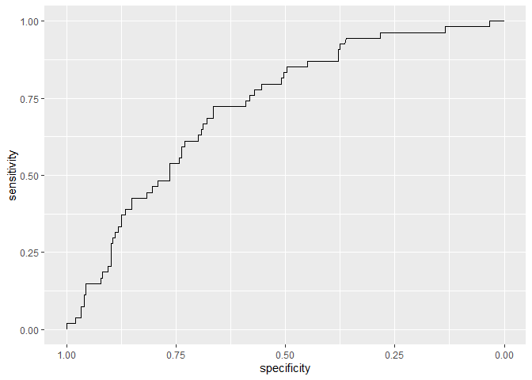

    library(biogram)

    ## Loading required package: slam

    library(seqR)
    library(ranger)
    library(bigstep)
    library(boot)
    library(pROC)

    ## Type 'citation("pROC")' for a citation.

    ## 
    ## Attaching package: 'pROC'

    ## The following objects are masked from 'package:stats':
    ## 
    ##     cov, smooth, var

    library(ggplot2)
    library(caret)

    ## Loading required package: lattice

    ## 
    ## Attaching package: 'lattice'

    ## The following object is masked from 'package:boot':
    ## 
    ##     melanoma

    ## Registered S3 method overwritten by 'lava':
    ##   method            from      
    ##   print.equivalence partitions

    library(dplyr)

    ## 
    ## Attaching package: 'dplyr'

    ## The following objects are masked from 'package:stats':
    ## 
    ##     filter, lag

    ## The following objects are masked from 'package:base':
    ## 
    ##     intersect, setdiff, setequal, union

    library(glmnet)

    ## Loading required package: Matrix

    ## Loaded glmnet 4.1-8

    library(tidyr)

    ## 
    ## Attaching package: 'tidyr'

    ## The following objects are masked from 'package:Matrix':
    ## 
    ##     expand, pack, unpack

    library(SLOPE)
    library(ggcorrplot)
    library(knitr)

    inv_logit <- function(xb) exp(xb)/(1 + exp(xb))

    df <- read.table("../llps_ml_dataset.csv", sep = "\t", header = TRUE)
    train_ids <- df[["Fold"]] == "Train"
    test_ids <- df[["Fold"]] == "Test"

    ### kmer space

    all_three_gaps <- expand.grid(0L:6, 0L:6)
    gaps_shorter_than6 <- all_three_gaps[rowSums(all_three_gaps) <= 6, ]

    k_vector_raw <- c(1, 2, 2, 2, 2, 2, rep(3, nrow(gaps_shorter_than6)))
    kmer_gaps_raw <- c(list(NULL, 
                            NULL, c(1), c(2), c(3), c(4)),
                       lapply(1L:nrow(gaps_shorter_than6), function(i)
                         unlist(gaps_shorter_than6[i, ], use.names = FALSE)))

    kmers <- count_multimers(
      df[["Full.seq"]],
      k_vector = k_vector_raw,
      kmer_gaps = kmer_gaps_raw,
      with_kmer_counts = FALSE,
      batch_size = 4)

    ######

    y <- !(df[["Datasets"]] %in% c("PDB", "DisProt"))

    train_y <- as.numeric(y[train_ids])
    train_x <- data.frame((as.matrix(kmers[train_ids, ])))

    ## Warning in asMethod(object): sparse->dense coercion: allocating vector of size
    ## 5.3 GiB

    test_y <- as.numeric(y[test_ids])
    test_x <- data.frame((as.matrix(kmers[test_ids, ])))

    AUC_and_FPR <- function(test_y, predicted){
      rocobj <- roc(test_y, predicted)
      auc_val <- auc(test_y, predicted)
      print(ggroc(rocobj))
      print("AUC:")
      print(auc_val)
      mat <- confusionMatrix(as.factor(as.numeric(predicted > 0.5)), as.factor(test_y))
      print(mat)
      print("FPR")
      print(mat$table[2, 1]/(mat$table[2, 1] + mat$table[1, 1]))
    }

## Wybór 100 zmiennych testami brzegowymi

    ranking <- readRDS("../ranking.RDS")
    candidates <- ranking[1:100]

    train_x_reduced <- as.matrix(train_x[, candidates])
    test_x_reduced <- as.matrix(test_x[, candidates])

    # glm

    logistic_model <- glm(train_y~., data = as.data.frame(train_x_reduced), family = "binomial")
    predicted <- predict(logistic_model, as.data.frame(test_x_reduced), type = "response")
    AUC_and_FPR(test_y, predicted)

    ## Setting levels: control = 0, case = 1

    ## Setting direction: controls < cases

    ## Setting levels: control = 0, case = 1

    ## Setting direction: controls < cases

    ## [1] "AUC:"
    ## Area under the curve: 0.686
    ## Confusion Matrix and Statistics
    ## 
    ##           Reference
    ## Prediction   0   1
    ##          0 283  48
    ##          1  13   6
    ##                                          
    ##                Accuracy : 0.8257         
    ##                  95% CI : (0.7818, 0.864)
    ##     No Information Rate : 0.8457         
    ##     P-Value [Acc > NIR] : 0.8658         
    ##                                          
    ##                   Kappa : 0.0914         
    ##                                          
    ##  Mcnemar's Test P-Value : 1.341e-05      
    ##                                          
    ##             Sensitivity : 0.9561         
    ##             Specificity : 0.1111         
    ##          Pos Pred Value : 0.8550         
    ##          Neg Pred Value : 0.3158         
    ##              Prevalence : 0.8457         
    ##          Detection Rate : 0.8086         
    ##    Detection Prevalence : 0.9457         
    ##       Balanced Accuracy : 0.5336         
    ##                                          
    ##        'Positive' Class : 0              
    ##                                          
    ## [1] "FPR"
    ## [1] 0.04391892

    #### random forest

    model_rf_small <- ranger(train_y ~ .,
                             data = cbind(train_y, train_x_reduced),
                             probability = TRUE)

    predicted <- predict(model_rf_small, test_x_reduced)[["predictions"]][, 1]
    AUC_and_FPR(test_y, predicted)

    ## Setting levels: control = 0, case = 1
    ## Setting direction: controls < cases

    ## Setting levels: control = 0, case = 1

    ## Setting direction: controls < cases

    ## [1] "AUC:"
    ## Area under the curve: 0.728
    ## Confusion Matrix and Statistics
    ## 
    ##           Reference
    ## Prediction   0   1
    ##          0 286  49
    ##          1  10   5
    ##                                          
    ##                Accuracy : 0.8314         
    ##                  95% CI : (0.788, 0.8691)
    ##     No Information Rate : 0.8457         
    ##     P-Value [Acc > NIR] : 0.7938         
    ##                                          
    ##                   Kappa : 0.0834         
    ##                                          
    ##  Mcnemar's Test P-Value : 7.53e-07       
    ##                                          
    ##             Sensitivity : 0.96622        
    ##             Specificity : 0.09259        
    ##          Pos Pred Value : 0.85373        
    ##          Neg Pred Value : 0.33333        
    ##              Prevalence : 0.84571        
    ##          Detection Rate : 0.81714        
    ##    Detection Prevalence : 0.95714        
    ##       Balanced Accuracy : 0.52940        
    ##                                          
    ##        'Positive' Class : 0              
    ##                                          
    ## [1] "FPR"
    ## [1] 0.03378378

    #### superlearner

    library(SuperLearner)

    ## Loading required package: nnls

    ## Loading required package: gam

    ## Loading required package: splines

    ## Loading required package: foreach

    ## Loaded gam 1.22-5

    ## Super Learner

    ## Version: 2.0-29

    ## Package created on 2024-02-06

    sl <- SuperLearner(Y = train_y, X = train_x_reduced, family = binomial(),
                       SL.library = c("SL.mean", "SL.glmnet", "SL.ranger"))

    ## X is not a data frame. Check the algorithms in SL.library to make sure they are compatible with non data.frame inputs

    predicted <- as.vector(unlist(predict(sl, test_x_reduced)$pred))
    AUC_and_FPR(test_y, predicted)

    ## Setting levels: control = 0, case = 1

    ## Setting direction: controls < cases

    ## Setting levels: control = 0, case = 1

    ## Setting direction: controls < cases

    ## [1] "AUC:"
    ## Area under the curve: 0.7216
    ## Confusion Matrix and Statistics
    ## 
    ##           Reference
    ## Prediction   0   1
    ##          0 286  52
    ##          1  10   2
    ##                                           
    ##                Accuracy : 0.8229          
    ##                  95% CI : (0.7787, 0.8614)
    ##     No Information Rate : 0.8457          
    ##     P-Value [Acc > NIR] : 0.8942          
    ##                                           
    ##                   Kappa : 0.0048          
    ##                                           
    ##  Mcnemar's Test P-Value : 1.919e-07       
    ##                                           
    ##             Sensitivity : 0.96622         
    ##             Specificity : 0.03704         
    ##          Pos Pred Value : 0.84615         
    ##          Neg Pred Value : 0.16667         
    ##              Prevalence : 0.84571         
    ##          Detection Rate : 0.81714         
    ##    Detection Prevalence : 0.96571         
    ##       Balanced Accuracy : 0.50163         
    ##                                           
    ##        'Positive' Class : 0               
    ##                                           
    ## [1] "FPR"
    ## [1] 0.03378378

    # LASSO

    lasso_cv <- cv.glmnet(train_x_reduced, train_y, family = "binomial")

    lambda_min <- lasso_cv$lambda.min

    lasso_res <- glmnet(train_x_reduced, train_y, family = "binomial",
                        lambda = lambda_min, thresh = 10^(-10), maxit = 10^(8))

    predicted <- predict.glmnet(lasso_res, newx = as.matrix(test_x_reduced), type = "response")
    predicted <- as.vector(inv_logit(predicted))

    AUC_and_FPR(test_y, predicted)

    ## Setting levels: control = 0, case = 1
    ## Setting direction: controls < cases

    ## Setting levels: control = 0, case = 1

    ## Setting direction: controls < cases

    ## [1] "AUC:"
    ## Area under the curve: 0.7063
    ## Confusion Matrix and Statistics
    ## 
    ##           Reference
    ## Prediction   0   1
    ##          0 285  52
    ##          1  11   2
    ##                                           
    ##                Accuracy : 0.82            
    ##                  95% CI : (0.7757, 0.8588)
    ##     No Information Rate : 0.8457          
    ##     P-Value [Acc > NIR] : 0.9179          
    ##                                           
    ##                   Kappa : -2e-04          
    ##                                           
    ##  Mcnemar's Test P-Value : 4.667e-07       
    ##                                           
    ##             Sensitivity : 0.96284         
    ##             Specificity : 0.03704         
    ##          Pos Pred Value : 0.84570         
    ##          Neg Pred Value : 0.15385         
    ##              Prevalence : 0.84571         
    ##          Detection Rate : 0.81429         
    ##    Detection Prevalence : 0.96286         
    ##       Balanced Accuracy : 0.49994         
    ##                                           
    ##        'Positive' Class : 0               
    ##                                           
    ## [1] "FPR"
    ## [1] 0.03716216

    # elastic net

    elastic_net <- glmnet(train_x_reduced, train_y, family = "binomial", 
                          alpha = 0.5, lambda = lambda_min, thresh = 10^(-10), 
                          maxit = 10^(8))

    predicted <- predict.glmnet(elastic_net, newx = as.matrix(test_x_reduced), type = "response")
    predicted <- as.vector(apply(predicted, 2, inv_logit))

    AUC_and_FPR(test_y, predicted)

    ## Setting levels: control = 0, case = 1
    ## Setting direction: controls < cases

    ## Setting levels: control = 0, case = 1

    ## Setting direction: controls < cases

    ## [1] "AUC:"
    ## Area under the curve: 0.7024
    ## Confusion Matrix and Statistics
    ## 
    ##           Reference
    ## Prediction   0   1
    ##          0 285  50
    ##          1  11   4
    ##                                          
    ##                Accuracy : 0.8257         
    ##                  95% CI : (0.7818, 0.864)
    ##     No Information Rate : 0.8457         
    ##     P-Value [Acc > NIR] : 0.8658         
    ##                                          
    ##                   Kappa : 0.0524         
    ##                                          
    ##  Mcnemar's Test P-Value : 1.142e-06      
    ##                                          
    ##             Sensitivity : 0.96284        
    ##             Specificity : 0.07407        
    ##          Pos Pred Value : 0.85075        
    ##          Neg Pred Value : 0.26667        
    ##              Prevalence : 0.84571        
    ##          Detection Rate : 0.81429        
    ##    Detection Prevalence : 0.95714        
    ##       Balanced Accuracy : 0.51846        
    ##                                          
    ##        'Positive' Class : 0              
    ##                                          
    ## [1] "FPR"
    ## [1] 0.03716216

    # ridge

    ridge <- glmnet(train_x_reduced, train_y, family = "binomial", 
                    lambda = lambda_min, alpha = 0, thresh = 10^(-10), maxit = 10^(8))

    predicted <- predict.glmnet(ridge, newx = as.matrix(test_x_reduced), type = "response")
    predicted <- as.vector(apply(predicted, 2, inv_logit))

    AUC_and_FPR(test_y, predicted)

    ## Setting levels: control = 0, case = 1
    ## Setting direction: controls < cases

    ## Setting levels: control = 0, case = 1

    ## Setting direction: controls < cases

    ## [1] "AUC:"
    ## Area under the curve: 0.69
    ## Confusion Matrix and Statistics
    ## 
    ##           Reference
    ## Prediction   0   1
    ##          0 283  48
    ##          1  13   6
    ##                                          
    ##                Accuracy : 0.8257         
    ##                  95% CI : (0.7818, 0.864)
    ##     No Information Rate : 0.8457         
    ##     P-Value [Acc > NIR] : 0.8658         
    ##                                          
    ##                   Kappa : 0.0914         
    ##                                          
    ##  Mcnemar's Test P-Value : 1.341e-05      
    ##                                          
    ##             Sensitivity : 0.9561         
    ##             Specificity : 0.1111         
    ##          Pos Pred Value : 0.8550         
    ##          Neg Pred Value : 0.3158         
    ##              Prevalence : 0.8457         
    ##          Detection Rate : 0.8086         
    ##    Detection Prevalence : 0.9457         
    ##       Balanced Accuracy : 0.5336         
    ##                                          
    ##        'Positive' Class : 0              
    ##                                          
    ## [1] "FPR"
    ## [1] 0.04391892

    ## slope

    res_slope <- SLOPE(train_x_reduced, train_y, family = "binomial", 
                       lambda = "bh", alpha = 0.01)

    predicted <- predict(res_slope, as.matrix(test_x_reduced), type = "response")

    AUC_and_FPR(test_y, predicted)

    ## Setting levels: control = 0, case = 1
    ## Setting direction: controls < cases

    ## Setting levels: control = 0, case = 1

    ## Setting direction: controls < cases

    ## [1] "AUC:"
    ## Area under the curve: 0.715
    ## Confusion Matrix and Statistics
    ## 
    ##           Reference
    ## Prediction   0   1
    ##          0 288  53
    ##          1   8   1
    ##                                          
    ##                Accuracy : 0.8257         
    ##                  95% CI : (0.7818, 0.864)
    ##     No Information Rate : 0.8457         
    ##     P-Value [Acc > NIR] : 0.8658         
    ##                                          
    ##                   Kappa : -0.0129        
    ##                                          
    ##  Mcnemar's Test P-Value : 1.765e-08      
    ##                                          
    ##             Sensitivity : 0.97297        
    ##             Specificity : 0.01852        
    ##          Pos Pred Value : 0.84457        
    ##          Neg Pred Value : 0.11111        
    ##              Prevalence : 0.84571        
    ##          Detection Rate : 0.82286        
    ##    Detection Prevalence : 0.97429        
    ##       Balanced Accuracy : 0.49575        
    ##                                          
    ##        'Positive' Class : 0              
    ##                                          
    ## [1] "FPR"
    ## [1] 0.02702703

## Wybór 100 zmiennych fast forward (RSS)

    # definiuję nowe kryterium (RSS)

    crit_RSS <- function(loglik, n, ...) exp(-(2/n) * loglik + log(n))

    ## Wybór 100 zmiennych fast forward (RSS)

    reduced_02 <- readRDS("../reduced_02.RDS")
    dat <- prepare_data(train_y, train_x[, reduced_02])

    model_100_ff <- dat %>%
      fast_forward(crit = crit_RSS, maxf = 100)

    candidates <- model_100_ff$model

    train_x_reduced <- as.matrix(train_x[, candidates])
    test_x_reduced <- as.matrix(test_x[, candidates])

    # glm

    logistic_model <- glm(train_y~., data = as.data.frame(train_x_reduced), family = "binomial")
    predicted <- predict(logistic_model, as.data.frame(test_x_reduced), type = "response")
    AUC_and_FPR(test_y, predicted)

    ## Setting levels: control = 0, case = 1

    ## Setting direction: controls < cases

    ## Setting levels: control = 0, case = 1

    ## Setting direction: controls < cases

    ## [1] "AUC:"
    ## Area under the curve: 0.686
    ## Confusion Matrix and Statistics
    ## 
    ##           Reference
    ## Prediction   0   1
    ##          0 283  48
    ##          1  13   6
    ##                                          
    ##                Accuracy : 0.8257         
    ##                  95% CI : (0.7818, 0.864)
    ##     No Information Rate : 0.8457         
    ##     P-Value [Acc > NIR] : 0.8658         
    ##                                          
    ##                   Kappa : 0.0914         
    ##                                          
    ##  Mcnemar's Test P-Value : 1.341e-05      
    ##                                          
    ##             Sensitivity : 0.9561         
    ##             Specificity : 0.1111         
    ##          Pos Pred Value : 0.8550         
    ##          Neg Pred Value : 0.3158         
    ##              Prevalence : 0.8457         
    ##          Detection Rate : 0.8086         
    ##    Detection Prevalence : 0.9457         
    ##       Balanced Accuracy : 0.5336         
    ##                                          
    ##        'Positive' Class : 0              
    ##                                          
    ## [1] "FPR"
    ## [1] 0.04391892

    #### random forest

    model_rf_small <- ranger(train_y ~ .,
                             data = cbind(train_y, train_x_reduced),
                             probability = TRUE)

    predicted <- predict(model_rf_small, test_x_reduced)[["predictions"]][, 1]
    AUC_and_FPR(test_y, predicted)

    ## Setting levels: control = 0, case = 1
    ## Setting direction: controls < cases

    ## Setting levels: control = 0, case = 1

    ## Setting direction: controls < cases

    ## [1] "AUC:"
    ## Area under the curve: 0.7224
    ## Confusion Matrix and Statistics
    ## 
    ##           Reference
    ## Prediction   0   1
    ##          0 284  50
    ##          1  12   4
    ##                                           
    ##                Accuracy : 0.8229          
    ##                  95% CI : (0.7787, 0.8614)
    ##     No Information Rate : 0.8457          
    ##     P-Value [Acc > NIR] : 0.8942          
    ##                                           
    ##                   Kappa : 0.0471          
    ##                                           
    ##  Mcnemar's Test P-Value : 2.614e-06       
    ##                                           
    ##             Sensitivity : 0.95946         
    ##             Specificity : 0.07407         
    ##          Pos Pred Value : 0.85030         
    ##          Neg Pred Value : 0.25000         
    ##              Prevalence : 0.84571         
    ##          Detection Rate : 0.81143         
    ##    Detection Prevalence : 0.95429         
    ##       Balanced Accuracy : 0.51677         
    ##                                           
    ##        'Positive' Class : 0               
    ##                                           
    ## [1] "FPR"
    ## [1] 0.04054054

    #### superlearner

    library(SuperLearner)

    sl <- SuperLearner(Y = train_y, X = train_x_reduced, family = binomial(),
                       SL.library = c("SL.mean", "SL.glmnet", "SL.ranger"))

    ## X is not a data frame. Check the algorithms in SL.library to make sure they are compatible with non data.frame inputs

    predicted <- as.vector(unlist(predict(sl, test_x_reduced)$pred))
    AUC_and_FPR(test_y, predicted)

    ## Setting levels: control = 0, case = 1
    ## Setting direction: controls < cases

    ## Setting levels: control = 0, case = 1

    ## Setting direction: controls < cases

    ## [1] "AUC:"
    ## Area under the curve: 0.7217
    ## Confusion Matrix and Statistics
    ## 
    ##           Reference
    ## Prediction   0   1
    ##          0 285  52
    ##          1  11   2
    ##                                           
    ##                Accuracy : 0.82            
    ##                  95% CI : (0.7757, 0.8588)
    ##     No Information Rate : 0.8457          
    ##     P-Value [Acc > NIR] : 0.9179          
    ##                                           
    ##                   Kappa : -2e-04          
    ##                                           
    ##  Mcnemar's Test P-Value : 4.667e-07       
    ##                                           
    ##             Sensitivity : 0.96284         
    ##             Specificity : 0.03704         
    ##          Pos Pred Value : 0.84570         
    ##          Neg Pred Value : 0.15385         
    ##              Prevalence : 0.84571         
    ##          Detection Rate : 0.81429         
    ##    Detection Prevalence : 0.96286         
    ##       Balanced Accuracy : 0.49994         
    ##                                           
    ##        'Positive' Class : 0               
    ##                                           
    ## [1] "FPR"
    ## [1] 0.03716216

    # LASSO

    lasso_cv <- cv.glmnet(train_x_reduced, train_y, family = "binomial")

    lambda_min <- lasso_cv$lambda.min

    lasso_res <- glmnet(train_x_reduced, train_y, family = "binomial",
                        lambda = lambda_min, thresh = 10^(-10), maxit = 10^(8))

    predicted <- predict.glmnet(lasso_res, newx = as.matrix(test_x_reduced), type = "response")
    predicted <- as.vector(inv_logit(predicted))

    AUC_and_FPR(test_y, predicted)

    ## Setting levels: control = 0, case = 1
    ## Setting direction: controls < cases

    ## Setting levels: control = 0, case = 1

    ## Setting direction: controls < cases

    ## [1] "AUC:"
    ## Area under the curve: 0.7073
    ## Confusion Matrix and Statistics
    ## 
    ##           Reference
    ## Prediction   0   1
    ##          0 285  52
    ##          1  11   2
    ##                                           
    ##                Accuracy : 0.82            
    ##                  95% CI : (0.7757, 0.8588)
    ##     No Information Rate : 0.8457          
    ##     P-Value [Acc > NIR] : 0.9179          
    ##                                           
    ##                   Kappa : -2e-04          
    ##                                           
    ##  Mcnemar's Test P-Value : 4.667e-07       
    ##                                           
    ##             Sensitivity : 0.96284         
    ##             Specificity : 0.03704         
    ##          Pos Pred Value : 0.84570         
    ##          Neg Pred Value : 0.15385         
    ##              Prevalence : 0.84571         
    ##          Detection Rate : 0.81429         
    ##    Detection Prevalence : 0.96286         
    ##       Balanced Accuracy : 0.49994         
    ##                                           
    ##        'Positive' Class : 0               
    ##                                           
    ## [1] "FPR"
    ## [1] 0.03716216

    # elastic net

    elastic_net <- glmnet(train_x_reduced, train_y, family = "binomial", 
                          alpha = 0.5, lambda = lambda_min, thresh = 10^(-10), 
                          maxit = 10^(8))

    predicted <- predict.glmnet(elastic_net, newx = as.matrix(test_x_reduced), type = "response")
    predicted <- as.vector(apply(predicted, 2, inv_logit))

    AUC_and_FPR(test_y, predicted)

    ## Setting levels: control = 0, case = 1
    ## Setting direction: controls < cases

    ## Setting levels: control = 0, case = 1

    ## Setting direction: controls < cases

    ## [1] "AUC:"
    ## Area under the curve: 0.7025
    ## Confusion Matrix and Statistics
    ## 
    ##           Reference
    ## Prediction   0   1
    ##          0 285  51
    ##          1  11   3
    ##                                           
    ##                Accuracy : 0.8229          
    ##                  95% CI : (0.7787, 0.8614)
    ##     No Information Rate : 0.8457          
    ##     P-Value [Acc > NIR] : 0.8942          
    ##                                           
    ##                   Kappa : 0.0264          
    ##                                           
    ##  Mcnemar's Test P-Value : 7.308e-07       
    ##                                           
    ##             Sensitivity : 0.96284         
    ##             Specificity : 0.05556         
    ##          Pos Pred Value : 0.84821         
    ##          Neg Pred Value : 0.21429         
    ##              Prevalence : 0.84571         
    ##          Detection Rate : 0.81429         
    ##    Detection Prevalence : 0.96000         
    ##       Balanced Accuracy : 0.50920         
    ##                                           
    ##        'Positive' Class : 0               
    ##                                           
    ## [1] "FPR"
    ## [1] 0.03716216

    # ridge

    ridge <- glmnet(train_x_reduced, train_y, family = "binomial", 
                    lambda = lambda_min, alpha = 0, thresh = 10^(-10), maxit = 10^(8))

    predicted <- predict.glmnet(ridge, newx = as.matrix(test_x_reduced), type = "response")
    predicted <- as.vector(apply(predicted, 2, inv_logit))

    AUC_and_FPR(test_y, predicted)

    ## Setting levels: control = 0, case = 1
    ## Setting direction: controls < cases

    ## Setting levels: control = 0, case = 1

    ## Setting direction: controls < cases

    ## [1] "AUC:"
    ## Area under the curve: 0.6901
    ## Confusion Matrix and Statistics
    ## 
    ##           Reference
    ## Prediction   0   1
    ##          0 283  49
    ##          1  13   5
    ##                                           
    ##                Accuracy : 0.8229          
    ##                  95% CI : (0.7787, 0.8614)
    ##     No Information Rate : 0.8457          
    ##     P-Value [Acc > NIR] : 0.8942          
    ##                                           
    ##                   Kappa : 0.0669          
    ##                                           
    ##  Mcnemar's Test P-Value : 8.789e-06       
    ##                                           
    ##             Sensitivity : 0.95608         
    ##             Specificity : 0.09259         
    ##          Pos Pred Value : 0.85241         
    ##          Neg Pred Value : 0.27778         
    ##              Prevalence : 0.84571         
    ##          Detection Rate : 0.80857         
    ##    Detection Prevalence : 0.94857         
    ##       Balanced Accuracy : 0.52434         
    ##                                           
    ##        'Positive' Class : 0               
    ##                                           
    ## [1] "FPR"
    ## [1] 0.04391892

    ## slope

    res_slope <- SLOPE(train_x_reduced, train_y, family = "binomial", 
                       lambda = "bh", alpha = 0.01)

    predicted <- predict(res_slope, as.matrix(test_x_reduced), type = "response")

    AUC_and_FPR(test_y, predicted)

    ## Setting levels: control = 0, case = 1
    ## Setting direction: controls < cases

    ## Setting levels: control = 0, case = 1

    ## Setting direction: controls < cases

    ## [1] "AUC:"
    ## Area under the curve: 0.715
    ## Confusion Matrix and Statistics
    ## 
    ##           Reference
    ## Prediction   0   1
    ##          0 288  53
    ##          1   8   1
    ##                                          
    ##                Accuracy : 0.8257         
    ##                  95% CI : (0.7818, 0.864)
    ##     No Information Rate : 0.8457         
    ##     P-Value [Acc > NIR] : 0.8658         
    ##                                          
    ##                   Kappa : -0.0129        
    ##                                          
    ##  Mcnemar's Test P-Value : 1.765e-08      
    ##                                          
    ##             Sensitivity : 0.97297        
    ##             Specificity : 0.01852        
    ##          Pos Pred Value : 0.84457        
    ##          Neg Pred Value : 0.11111        
    ##              Prevalence : 0.84571        
    ##          Detection Rate : 0.82286        
    ##    Detection Prevalence : 0.97429        
    ##       Balanced Accuracy : 0.49575        
    ##                                          
    ##        'Positive' Class : 0              
    ##                                          
    ## [1] "FPR"
    ## [1] 0.02702703

-   AUC:

<table>
<colgroup>
<col style="width: 29%" />
<col style="width: 23%" />
<col style="width: 23%" />
<col style="width: 23%" />
</colgroup>
<thead>
<tr class="header">
<th>models</th>
<th>testy brzegowe</th>
<th>fast forward</th>
<th>fast forward + backward</th>
</tr>
</thead>
<tbody>
<tr class="odd">
<td>GLM</td>
<td>0.686</td>
<td>0.686</td>
<td>-</td>
</tr>
<tr class="even">
<td>random forest</td>
<td>0.7245</td>
<td>0.7262</td>
<td>-</td>
</tr>
<tr class="odd">
<td>super learner</td>
<td>0.7174</td>
<td>0.5439189</td>
<td>-</td>
</tr>
<tr class="even">
<td>lasso</td>
<td>0.7065190</td>
<td>0.7081</td>
<td>-</td>
</tr>
<tr class="odd">
<td>elastic net</td>
<td>0.7030468</td>
<td>0.703</td>
<td>-</td>
</tr>
<tr class="even">
<td>ridge</td>
<td>0.6901589</td>
<td>0.6904</td>
<td>-</td>
</tr>
<tr class="odd">
<td>slope</td>
<td>0.7129630</td>
<td>0.715</td>
<td>-</td>
</tr>
</tbody>
</table>

-   FPR:

<table>
<colgroup>
<col style="width: 29%" />
<col style="width: 23%" />
<col style="width: 23%" />
<col style="width: 23%" />
</colgroup>
<thead>
<tr class="header">
<th>models</th>
<th>testy brzegowe</th>
<th>fast forward</th>
<th>fast forward + backward</th>
</tr>
</thead>
<tbody>
<tr class="odd">
<td>GLM</td>
<td>0.04391892</td>
<td>0.04391892</td>
<td>-</td>
</tr>
<tr class="even">
<td>random forest</td>
<td>0.04054054</td>
<td>0.03716216</td>
<td>-</td>
</tr>
<tr class="odd">
<td>super learner</td>
<td>0.03378378</td>
<td>0.03378378</td>
<td>-</td>
</tr>
<tr class="even">
<td>lasso</td>
<td>0.03716216</td>
<td>0.03378378</td>
<td>-</td>
</tr>
<tr class="odd">
<td>elastic net</td>
<td>0.03716216</td>
<td>0.03716216</td>
<td>-</td>
</tr>
<tr class="even">
<td>ridge</td>
<td>0.04391892</td>
<td>0.04391892</td>
<td>-</td>
</tr>
<tr class="odd">
<td>slope</td>
<td>0.02702703</td>
<td>0.02702703</td>
<td>-</td>
</tr>
</tbody>
</table>
