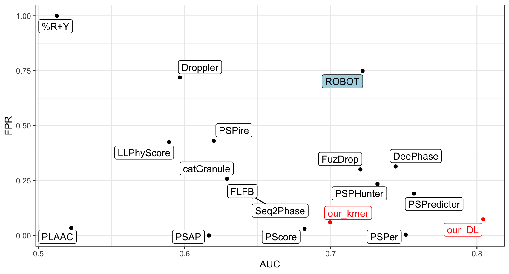
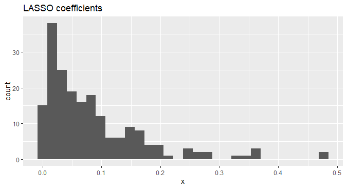
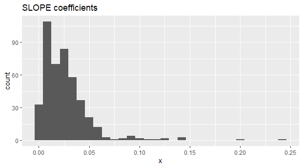

## Podsumowanie danych

-   liczba obserwacji: 3498 (2951 negatywnych i 547 pozytywnych),

-   liczba obserwacji w zbiorze treningowym: 3148 (2655 negatywnych i
    493 pozytywnych),

-   liczba obserwacji w zbiorze testowym: 350 (296 negatywnych i 54
    pozytywnych).

-   przestrzeń k-merowa: k-mery o długości od 1 do 3 z przerwami do
    łącznej długości maksymalnie 10

-   liczba zmiennych: 226 013

## Benchmark Michała

<figure>

<figcaption aria-hidden="true">benchmark narzędzi do predykcji llps
(czerwone modele Michała)</figcaption>
</figure>

## Ranking z testów brzegowych (korelacje Pearsona)

Wybieramy pierwsze X zmiennych na podstawie rankingu opartego o testy na
korelację.

#### Wyniki AUC:

<table>
<thead>
<tr class="header">
<th>models</th>
<th>X100</th>
<th>X1000</th>
<th>X3000</th>
<th>X5000</th>
</tr>
</thead>
<tbody>
<tr class="odd">
<td>lasso</td>
<td>0.7065190</td>
<td>0.7085836</td>
<td>0.7136512</td>
<td>0.7105856</td>
</tr>
<tr class="even">
<td>elastic net</td>
<td>0.7030468</td>
<td>0.6910661</td>
<td>0.6905656</td>
<td>0.7018268</td>
</tr>
<tr class="odd">
<td>ridge</td>
<td>0.6901589</td>
<td>0.5439189</td>
<td>0.5513013</td>
<td>NA</td>
</tr>
<tr class="even">
<td>slope</td>
<td>0.7129630</td>
<td>0.7145896</td>
<td>0.7223473</td>
<td>0.7277277</td>
</tr>
</tbody>
</table>

-   ridge działa najgorzej - przy większej liczbie zmiennych bardzo
    długo trzeba czekać na wynik

-   najlepiej działa SLOPE, ale różnice pomiędzy SLOPE i LASSO są
    niewielkie

#### Wyniki FPR

<table>
<thead>
<tr class="header">
<th>models</th>
<th>X100</th>
<th>X1000</th>
<th>X3000</th>
<th>X5000</th>
</tr>
</thead>
<tbody>
<tr class="odd">
<td>lasso</td>
<td>0.0337</td>
<td>0.0337</td>
<td>0.0304</td>
<td>0.0304</td>
</tr>
<tr class="even">
<td>elastic net</td>
<td>0.0371</td>
<td>0.0506</td>
<td>0.0506</td>
<td>0.0506</td>
</tr>
<tr class="odd">
<td>ridge</td>
<td>0.0439</td>
<td>0.0810</td>
<td>0.0810</td>
<td>NA</td>
</tr>
<tr class="even">
<td>slope</td>
<td>0.0304</td>
<td>0.0270</td>
<td>0.0202</td>
<td>0.0236</td>
</tr>
</tbody>
</table>

-   LASSO wybiera najmniej zmiennych, SLOPE wybiera mniej więcej 2x tyle
    (w poniższej tabeli liczba niezerowych zmiennych)

<table>
<thead>
<tr class="header">
<th>models</th>
<th>X100</th>
<th>X1000</th>
<th>X3000</th>
<th>X5000</th>
</tr>
</thead>
<tbody>
<tr class="odd">
<td>lasso</td>
<td>47</td>
<td>105</td>
<td>158</td>
<td>196</td>
</tr>
<tr class="even">
<td>elastic net</td>
<td>58</td>
<td>256</td>
<td>423</td>
<td>535</td>
</tr>
<tr class="odd">
<td>slope</td>
<td>65</td>
<td>205</td>
<td>372</td>
<td>446</td>
</tr>
</tbody>
</table>

<figure>

<figcaption aria-hidden="true">histogram niezerowych współczynników
LASSO</figcaption>
</figure>

<figure>

<figcaption aria-hidden="true">histogram niezerowych współczynników
SLOPE</figcaption>
</figure>

## mbic2 i stepwise

mbic2 ze stepwisem na zbiorze k-merów wstępnie przefiltrowanych testami
brzegowymi z thresholdem 0.2 (trochę ponad 100 000 k-merów) wybiera 12
k-merów:

    readRDS("../mbic_vars.RDS")

    ##  [1] "Q.Q.P_0.5" "S.S.S_0.0" "R.G.G_0.0" "Q.Q.P_5.1" "S.N.N_4.2" "K.K.H_4.2"
    ##  [7] "Y.P.P_1.0" "G.S.S_1.2" "P.V.P_4.1" "R.G.R_5.1" "Q.Q.N_4.2" "K.Q.S_1.2"

### zmienne z mbic2

$$FPR = \dfrac{FP}{FP + TN}$$

-   **logistyczny GLM** ma tym zbiorze ma AUC: 0.697, FPR: 0.054. To
    jest porównywalny wynik do modelu k-merowego Michała,

-   **lasy losowe** (domyślne) AUC: 0.6994, FPR: 0.0506. (Bardzo
    podobnie do GLM),

-   **Super Learner** (domyślnie “SL.mean”, “SL.glmnet”, “SL.ranger”)
    AUC: 0.6971, FPR: 0.0540,

### mbic2 i korelacje

-   szukałam k-merów skorelowanych z k-merami wybranymi przez mbic2 na
    poziomie korelacji co najmniej ± 0.8,

-   nie ma takich k-merów.

### mbic2 i interakcje

-   Buduję modele w oparciu o interakcje pomiędzy zmiennymi wybranymi
    przez mbic2
-   Modele dla rzędu interakcji k mają p zmiennych, gdzie

$$p = \sum\_{i = 1}^k{12\choose i} +1.$$
Dla kolejnych rzędów mamy

    cumsum(choose(12, 1:4)) + 1

    ## [1]  13  79 299 794

Wyniki AUC:

<table>
<colgroup>
<col style="width: 17%" />
<col style="width: 27%" />
<col style="width: 27%" />
<col style="width: 27%" />
</colgroup>
<thead>
<tr class="header">
<th>Model</th>
<th>Interakcje 2 rzędu</th>
<th>Interakcje 3 rzędu</th>
<th>Interakcje 4 rzędu</th>
</tr>
</thead>
<tbody>
<tr class="odd">
<td>GLM</td>
<td>0.7056</td>
<td>0.5184</td>
<td>0.5594</td>
</tr>
<tr class="even">
<td>LASSO</td>
<td>0.7020</td>
<td>0.7004</td>
<td>0.7019</td>
</tr>
<tr class="odd">
<td>Elastic Net</td>
<td>0.7015</td>
<td>0.7022</td>
<td>0.7012</td>
</tr>
<tr class="even">
<td>Ridge</td>
<td>0.7057</td>
<td>0.6951</td>
<td>0.6873</td>
</tr>
<tr class="odd">
<td>SLOPE</td>
<td>0.7028</td>
<td>0.7017</td>
<td>0.6983</td>
</tr>
</tbody>
</table>

Wyniki FPR:

<table>
<colgroup>
<col style="width: 17%" />
<col style="width: 27%" />
<col style="width: 27%" />
<col style="width: 27%" />
</colgroup>
<thead>
<tr class="header">
<th>Model</th>
<th>Interakcje 2 rzędu</th>
<th>Interakcje 3 rzędu</th>
<th>Interakcje 4 rzędu</th>
</tr>
</thead>
<tbody>
<tr class="odd">
<td>GLM</td>
<td>0.0743</td>
<td>0.0743</td>
<td>0.2331</td>
</tr>
<tr class="even">
<td>LASSO</td>
<td>0.0472</td>
<td>0.0472</td>
<td>0.0540</td>
</tr>
<tr class="odd">
<td>Elastic Net</td>
<td>0.0540</td>
<td>0.0540</td>
<td>0.0506</td>
</tr>
<tr class="even">
<td>Ridge</td>
<td>0.0641</td>
<td>0.0641</td>
<td>0.0709</td>
</tr>
<tr class="odd">
<td>SLOPE</td>
<td>0.0135</td>
<td>0.0135</td>
<td>0.0101</td>
</tr>
</tbody>
</table>

## mAIC i stepwise

    readRDS("../maic_vars.RDS")

    ##  [1] "Q.Q.P_0.5" "S.S.S_0.0" "Q.Q.Q_0.5" "P.P.P_0.0" "Q.Q.P_5.1" "S.P.Q_2.3"
    ##  [7] "G.S.S_1.2" "R.G.G_0.0" "S.N.N_4.2" "R.G.G_4.2" "K.K.H_4.2" "R.S.R_3.2"

-   Mamy tyle samo zmiennych co w przypadku mBIC2 (ale nie są to te same
    zmienne).

-   **model glm** AUC: 0.7018, FPR: 0.0472,

-   **lasy losowe** AUC: 0.7144, FPR: 0.0337,

-   **super learner**, AUC: 0.7111, FPR: 0.0405.

-   jest poprawa w stosunku do modelu budowanego w oparciu o zmienne z
    mBIC2

### mAIC i interakcje

-   Tabela z AUC:

<table>
<thead>
<tr class="header">
<th>Model</th>
<th>Interakcje 2 rzędu</th>
<th>Interakcje 3 rzędu</th>
</tr>
</thead>
<tbody>
<tr class="odd">
<td>GLM</td>
<td>0.7145</td>
<td>0.5133</td>
</tr>
<tr class="even">
<td>LASSO</td>
<td>0.7116</td>
<td>0.7092</td>
</tr>
<tr class="odd">
<td>Elastic Net</td>
<td>0.7113</td>
<td>0.7097</td>
</tr>
<tr class="even">
<td>Ridge</td>
<td>0.7152</td>
<td>0.6907</td>
</tr>
<tr class="odd">
<td>SLOPE</td>
<td>0.7142</td>
<td>0.7185</td>
</tr>
</tbody>
</table>

-   Dodanie interakcji 3-ciego rzędu poprawiło nieznacznie SLOPE. Reszta
    modeli się popsuła
-   Tabela z FPR:

<table>
<thead>
<tr class="header">
<th>Model</th>
<th>Interakcje 2 rzędu</th>
<th>Interakcje 3 rzędu</th>
</tr>
</thead>
<tbody>
<tr class="odd">
<td>GLM</td>
<td>0.0540</td>
<td>0.1216</td>
</tr>
<tr class="even">
<td>LASSO</td>
<td>0.0405</td>
<td>0.0405</td>
</tr>
<tr class="odd">
<td>Elastic Net</td>
<td>0.0439</td>
<td>0.0337</td>
</tr>
<tr class="even">
<td>Ridge</td>
<td>0.0540</td>
<td>0.0472</td>
</tr>
<tr class="odd">
<td>SLOPE</td>
<td>0.0202</td>
<td>0.0202</td>
</tr>
</tbody>
</table>

## Wybór 100 zmiennych

-   testy brzegowe,

-   fast forward

-   fast forward (500) i backward (100)

-   AUC:

<table>
<colgroup>
<col style="width: 29%" />
<col style="width: 23%" />
<col style="width: 23%" />
<col style="width: 23%" />
</colgroup>
<thead>
<tr class="header">
<th>models</th>
<th>testy brzegowe</th>
<th>fast forward</th>
<th>fast forward + backward</th>
</tr>
</thead>
<tbody>
<tr class="odd">
<td>GLM</td>
<td>0.686</td>
<td>0.686</td>
<td>-</td>
</tr>
<tr class="even">
<td>random forest</td>
<td>0.7245</td>
<td>0.7262</td>
<td>-</td>
</tr>
<tr class="odd">
<td>super learner</td>
<td>0.7174</td>
<td>0.7217</td>
<td>-</td>
</tr>
<tr class="even">
<td>lasso</td>
<td>0.7065190</td>
<td>0.7081</td>
<td>-</td>
</tr>
<tr class="odd">
<td>elastic net</td>
<td>0.7030468</td>
<td>0.703</td>
<td>-</td>
</tr>
<tr class="even">
<td>ridge</td>
<td>0.6901589</td>
<td>0.6904</td>
<td>-</td>
</tr>
<tr class="odd">
<td>slope</td>
<td>0.7129630</td>
<td>0.715</td>
<td>-</td>
</tr>
</tbody>
</table>

-   FPR:

<table>
<colgroup>
<col style="width: 29%" />
<col style="width: 23%" />
<col style="width: 23%" />
<col style="width: 23%" />
</colgroup>
<thead>
<tr class="header">
<th>models</th>
<th>testy brzegowe</th>
<th>fast forward</th>
<th>fast forward + backward</th>
</tr>
</thead>
<tbody>
<tr class="odd">
<td>GLM</td>
<td>0.04391892</td>
<td>0.04391892</td>
<td>-</td>
</tr>
<tr class="even">
<td>random forest</td>
<td>0.04054054</td>
<td>0.03716216</td>
<td>-</td>
</tr>
<tr class="odd">
<td>super learner</td>
<td>0.03378378</td>
<td>0.03378378</td>
<td>-</td>
</tr>
<tr class="even">
<td>lasso</td>
<td>0.03716216</td>
<td>0.03378378</td>
<td>-</td>
</tr>
<tr class="odd">
<td>elastic net</td>
<td>0.03716216</td>
<td>0.03716216</td>
<td>-</td>
</tr>
<tr class="even">
<td>ridge</td>
<td>0.04391892</td>
<td>0.04391892</td>
<td>-</td>
</tr>
<tr class="odd">
<td>slope</td>
<td>0.02702703</td>
<td>0.02702703</td>
<td>-</td>
</tr>
</tbody>
</table>
